    ## Warning in read_xlsx_(path, sheet, col_names = col_names, col_types =
    ## col_types, : [138, 19]: expecting numeric: got 'E'

    ## Warning in read_xlsx_(path, sheet, col_names = col_names, col_types =
    ## col_types, : [185, 21]: expecting numeric: got 'W'

    ## Warning in read_xlsx_(path, sheet, col_names = col_names, col_types =
    ## col_types, : [292, 21]: expecting numeric: got 'S'

    ## Warning in read_xlsx_(path, sheet, col_names = col_names, col_types =
    ## col_types, : [377, 21]: expecting numeric: got 'E'

    ## Warning in read_xlsx_(path, sheet, col_names = col_names, col_types =
    ## col_types, : [570, 19]: expecting numeric: got 'S'

    ## Warning in read_xlsx_(path, sheet, col_names = col_names, col_types =
    ## col_types, : [634, 19]: expecting numeric: got 'S'

    ## Warning in read_xlsx_(path, sheet, col_names = col_names, col_types =
    ## col_types, : [1049, 19]: expecting numeric: got 'E'

    ## Warning in read_xlsx_(path, sheet, col_names = col_names, col_types =
    ## col_types, : [1582, 19]: expecting numeric: got 'N'

    ## Warning in read_xlsx_(path, sheet, col_names = col_names, col_types =
    ## col_types, : [1689, 19]: expecting numeric: got 'W'

    ## Warning in read_xlsx_(path, sheet, col_names = col_names, col_types =
    ## col_types, : [1804, 21]: expecting numeric: got 'W'

    ## Warning in read_xlsx_(path, sheet, col_names = col_names, col_types =
    ## col_types, : [1818, 19]: expecting numeric: got 'N'

    ## Warning in read_xlsx_(path, sheet, col_names = col_names, col_types =
    ## col_types, : [1878, 21]: expecting numeric: got 'E'

    ## Warning in read_xlsx_(path, sheet, col_names = col_names, col_types =
    ## col_types, : [1914, 19]: expecting numeric: got 'E'

    ## Warning in read_xlsx_(path, sheet, col_names = col_names, col_types =
    ## col_types, : [1952, 19]: expecting numeric: got 'S'

    ## Warning in read_xlsx_(path, sheet, col_names = col_names, col_types =
    ## col_types, : [2218, 19]: expecting numeric: got 'S'

    ## Warning in read_xlsx_(path, sheet, col_names = col_names, col_types =
    ## col_types, : [2244, 21]: expecting numeric: got 'E'

    ## Warning in read_xlsx_(path, sheet, col_names = col_names, col_types =
    ## col_types, : [2304, 19]: expecting numeric: got 'S'

    ## Warning in read_xlsx_(path, sheet, col_names = col_names, col_types =
    ## col_types, : [2634, 19]: expecting numeric: got 'W'

    ## Warning in read_xlsx_(path, sheet, col_names = col_names, col_types =
    ## col_types, : [2787, 21]: expecting numeric: got 'W'

    ## Warning in read_xlsx_(path, sheet, col_names = col_names, col_types =
    ## col_types, : [2889, 21]: expecting numeric: got 'E'

    ## Warning in read_xlsx_(path, sheet, col_names = col_names, col_types =
    ## col_types, : [3195, 21]: expecting numeric: got 'S'

    ## Warning in read_xlsx_(path, sheet, col_names = col_names, col_types =
    ## col_types, : [3249, 21]: expecting numeric: got 'W'

    ## Warning in read_xlsx_(path, sheet, col_names = col_names, col_types =
    ## col_types, : [3258, 21]: expecting numeric: got 'W'

    ## Warning in read_xlsx_(path, sheet, col_names = col_names, col_types =
    ## col_types, : [3271, 21]: expecting numeric: got 'E'

    ## Classes 'tbl_df', 'tbl' and 'data.frame':    3302 obs. of  24 variables:
    ##  $ Incident Number        : chr  "17-0006578" "17-0006579" "17-0006580" "17-0006582" ...
    ##  $ Exposure Number        : num  0 0 0 0 0 0 0 0 0 0 ...
    ##  $ Alarm Date             : chr  "01-Feb-17" "01-Feb-17" "01-Feb-17" "01-Feb-17" ...
    ##  $ Alarm Time             : chr  "00:44:33" "00:46:06" "01:12:34" "01:48:31" ...
    ##  $ Incident Type          : chr  "745" "111" "651" "735" ...
    ##  $ Incident Description   : chr  "Alarm system activation, no fire - unintentional" "Building fire" "Smoke scare, odor of smoke" "Alarm system sounded due to malfunction" ...
    ##  $ Estimated Property Loss: num  0 2500 0 0 0 0 0 0 0 0 ...
    ##  $ Estimated Content Loss : num  0 500 0 0 0 0 0 0 0 500 ...
    ##  $ District               : chr  "01" "08" "09" "11" ...
    ##  $ City Section           : chr  "EB" "MT" "JP" "BR" ...
    ##  $ Neighborhood           : chr  "East Boston" "Mattapan" "Jamaica Plain" "Allston-Brighton" ...
    ##  $ Zip                    : chr  "02128" "02126" "02130" "02135" ...
    ##  $ Property Use           : chr  "155" "419" "429" "429" ...
    ##  $ Property Description   : chr  "Courthouse" "1 or 2 family dwelling" "Multifamily dwelling" "Multifamily dwelling" ...
    ##  $ Street Number          : chr  "37" "371" "55" "20" ...
    ##  $ Street Prefix          : chr  NA NA NA NA ...
    ##  $ Street Name            : chr  "MERIDIAN" "RIVER" "ELIOT" "WASHINGTON" ...
    ##  $ Street Type            : chr  "ST" "ST" "ST" "ST" ...
    ##  $ Street Suffix          : num  NA NA NA NA NA NA NA NA NA NA ...
    ##  $ Address 2              : chr  ": #12-6153" NA NA ": #14-531" ...
    ##  $ xStreet Prefix         : num  NA NA NA NA NA NA NA NA NA NA ...
    ##  $ xStreet Name           : chr  NA NA NA NA ...
    ##  $ xStreet Type           : chr  NA NA NA NA ...
    ##  $ xStreet Suffix         : num  NA NA NA NA NA NA NA NA NA NA ...

    ## 
    ## FALSE  TRUE 
    ##  2927   375

    ## 
    ## FALSE  TRUE 
    ##   284  3018

    ## 
    ##                                   Aircraft standby 
    ##                                                  4 
    ##   Alarm system activation, no fire - unintentional 
    ##                                                163 
    ##            Alarm system sounded due to malfunction 
    ##                                                 92 
    ##                                     Animal problem 
    ##                                                  1 
    ##                              Animal problem, Other 
    ##                                                  1 
    ##               Arcing, shorted electrical equipment 
    ##                                                 20 
    ##                                     Assist invalid 
    ##                                                103 
    ##         Assist police or other governmental agency 
    ##                                                 40 
    ##                                    Attempt to burn 
    ##                                                  1 
    ##                                          BFD Drill 
    ##                                                 63 
    ##                    Biological hazard investigation 
    ##                                                  1 
    ##          Biological hazard, confirmed or suspected 
    ##                                                  3 
    ##                               Bomb scare - no bomb 
    ##                                                  2 
    ##                         Breakdown of light ballast 
    ##                                                  1 
    ##              Brush or brush-and-grass mixture fire 
    ##                                                  6 
    ##                                      Building fire 
    ##                                                 28 
    ##         Carbon monoxide detector activation, no CO 
    ##                                                 18 
    ##                           Carbon monoxide incident 
    ##                                                 29 
    ##             Central station, malicious false alarm 
    ##                                                238 
    ##                 Chemical hazard (no spill or leak) 
    ##                                                  4 
    ##                             Chemical spill or leak 
    ##                                                  2 
    ##                                  Citizen complaint 
    ##                                                  2 
    ##          CO detector activation due to malfunction 
    ##                                                 37 
    ##  Combustible/flammable gas/liquid condition, other 
    ##                                                  1 
    ##                Cooking fire, confined to container 
    ##                                                296 
    ##                  Cover assignment, standby, moveup 
    ##                                                  4 
    ##                   Defective elevator, no occupants 
    ##                                                  3 
    ##       Detector activation, no fire - unintentional 
    ##                                                 22 
    ##            Direct tie to FD, malicious false alarm 
    ##                                                 65 
    ##                    Dispatched & cancelled en route 
    ##                                                153 
    ##    Dumpster or other outside trash receptacle fire 
    ##                                                  5 
    ##        Electrical  wiring/equipment problem, Other 
    ##                                                 34 
    ##                    Extinguishing system activation 
    ##                                                  1 
    ##                   False alarm or false call, Other 
    ##                                                 30 
    ##                                        Fire, Other 
    ##                                                  7 
    ##     FIU activity  (not covered by other inc types) 
    ##                                                  4 
    ##      Fuel burner/boiler malfunction, fire confined 
    ##                                                  4 
    ##                      Gas leak (natural gas or LPG) 
    ##                                                 51 
    ##           Gasoline or other flammable liquid spill 
    ##                                                 28 
    ##                            Good intent call, Other 
    ##                                                197 
    ##                         Hazardous condition, Other 
    ##                                                 42 
    ##           HazMat release investigation w/no HazMat 
    ##                                                  5 
    ##        Heat detector activation due to malfunction 
    ##                                                  7 
    ##   Heat from short circuit (wiring), defective/worn 
    ##                                                  5 
    ##          Local alarm system, malicious false alarm 
    ##                                                 69 
    ##                                           Lock-out 
    ##                                                 56 
    ##           Malicious, mischievous false call, Other 
    ##                                                 13 
    ##              Mobile property (vehicle) fire, Other 
    ##                                                  2 
    ##      Municipal alarm system, malicious false alarm 
    ##                                                 40 
    ##                     Natural vegetation fire, Other 
    ##                                                  3 
    ##   No Incident found on arrival at dispatch address 
    ##                                                  6 
    ##              Oil or other combustible liquid spill 
    ##                                                 29 
    ##                             Outside equipment fire 
    ##                                                  5 
    ##                        Outside rubbish fire, Other 
    ##                                                 11 
    ##               Outside rubbish, trash or waste fire 
    ##                                                 16 
    ##  Outside stationary compactor/compacted trash fire 
    ##                                                  2 
    ##                                   Overheated motor 
    ##                                                 12 
    ##               Overpressure rupture of steam boiler 
    ##                                                  2 
    ##                             Passenger vehicle fire 
    ##                                                 17 
    ##                          Person in distress, Other 
    ##                                                  9 
    ##                                      Police matter 
    ##                                                 48 
    ##                                    Power line down 
    ##                                                 15 
    ##                                     Public service 
    ##                                                320 
    ##                   Public service assistance, Other 
    ##                                                 24 
    ##                                  Rail vehicle fire 
    ##                                                  2 
    ##                                 Refrigeration leak 
    ##                                                  2 
    ##             Road freight or transport vehicle fire 
    ##                                                  2 
    ##                                Service Call, other 
    ##                                                 63 
    ##          Severe weather or natural disaster, Other 
    ##                                                  5 
    ##       Smoke detector activation due to malfunction 
    ##                                                 43 
    ## Smoke detector activation, no fire - unintentional 
    ##                                                136 
    ##                    Smoke from barbecue, tar kettle 
    ##                                                  9 
    ##                              Smoke or odor removal 
    ##                                                  9 
    ##                         Smoke scare, odor of smoke 
    ##                                                 57 
    ##                        Special outside fire, Other 
    ##                                                  2 
    ##                    Special type of incident, Other 
    ##                                                149 
    ##            Sprinkler activation due to malfunction 
    ##                                                 18 
    ##      Sprinkler activation, no fire - unintentional 
    ##                                                  5 
    ##         Steam, Other gas mistaken for smoke, Other 
    ##                                                  6 
    ##      Steam, vapor, fog or dust thought to be smoke 
    ##                                                 65 
    ##                          System malfunction, Other 
    ##                                                 21 
    ##                   Telephone, malicious false alarm 
    ##                                                  5 
    ##                   Trash or rubbish fire, contained 
    ##                                                 12 
    ##         Unintentional transmission of alarm, Other 
    ##                                                 30 
    ##        Vicinity alarm (incident in other location) 
    ##                                                 15 
    ##                                   Water evacuation 
    ##                                                  1 
    ##                                Water or steam leak 
    ##                                                 96 
    ##                               Water problem, Other 
    ##                                                  5 
    ##                                     Wrong location 
    ##                                                 22

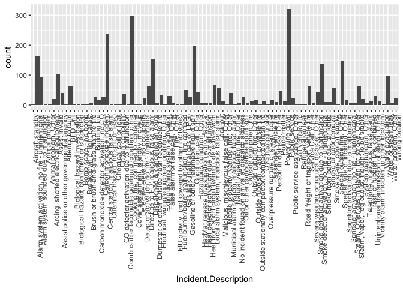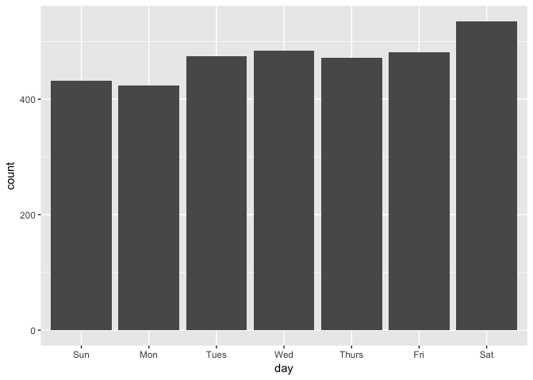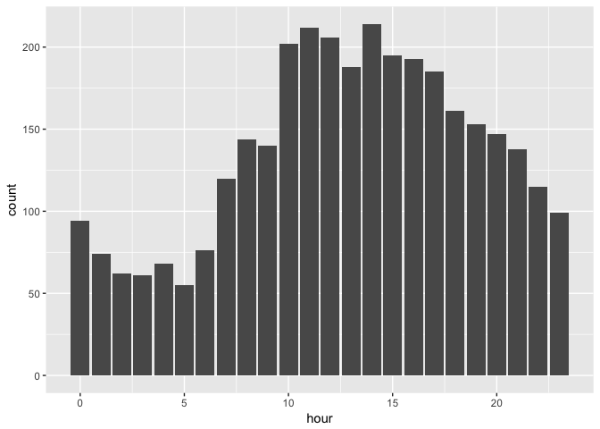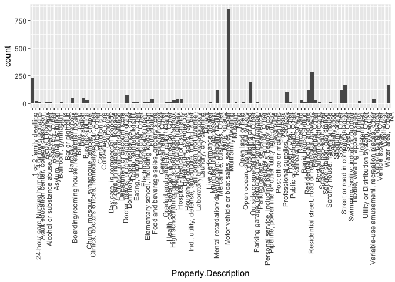

    ## Warning: bounding box given to google - spatial extent only approximate.

    ## converting bounding box to center/zoom specification. (experimental)

    ## Source : https://maps.googleapis.com/maps/api/staticmap?center=42.314435,-71.088306&zoom=12&size=640x640&scale=2&maptype=terrain&language=en-EN

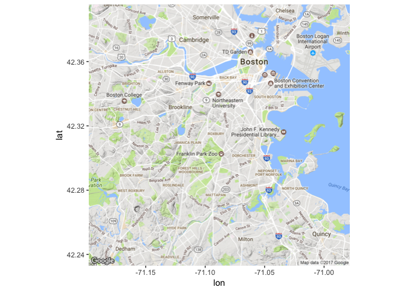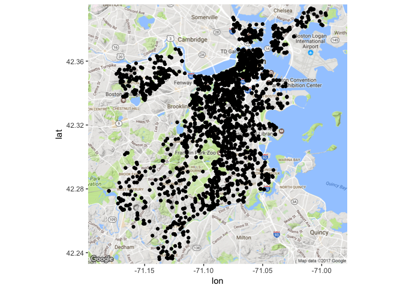

    ## 
    ##                                   Aircraft standby 
    ##                                                  4 
    ##   Alarm system activation, no fire - unintentional 
    ##                                                138 
    ##            Alarm system sounded due to malfunction 
    ##                                                 79 
    ##                                     Animal problem 
    ##                                                  1 
    ##                              Animal problem, Other 
    ##                                                  1 
    ##               Arcing, shorted electrical equipment 
    ##                                                 14 
    ##                                     Assist invalid 
    ##                                                 99 
    ##         Assist police or other governmental agency 
    ##                                                 27 
    ##                                          BFD Drill 
    ##                                                 33 
    ##          Biological hazard, confirmed or suspected 
    ##                                                  2 
    ##                               Bomb scare - no bomb 
    ##                                                  1 
    ##                         Breakdown of light ballast 
    ##                                                  1 
    ##              Brush or brush-and-grass mixture fire 
    ##                                                  5 
    ##                                      Building fire 
    ##                                                 25 
    ##         Carbon monoxide detector activation, no CO 
    ##                                                 18 
    ##                           Carbon monoxide incident 
    ##                                                 28 
    ##             Central station, malicious false alarm 
    ##                                                216 
    ##                 Chemical hazard (no spill or leak) 
    ##                                                  2 
    ##                             Chemical spill or leak 
    ##                                                  1 
    ##                                  Citizen complaint 
    ##                                                  1 
    ##          CO detector activation due to malfunction 
    ##                                                 34 
    ##  Combustible/flammable gas/liquid condition, other 
    ##                                                  1 
    ##                Cooking fire, confined to container 
    ##                                                261 
    ##                   Defective elevator, no occupants 
    ##                                                  3 
    ##       Detector activation, no fire - unintentional 
    ##                                                 18 
    ##            Direct tie to FD, malicious false alarm 
    ##                                                 54 
    ##                    Dispatched & cancelled en route 
    ##                                                123 
    ##    Dumpster or other outside trash receptacle fire 
    ##                                                  5 
    ##        Electrical  wiring/equipment problem, Other 
    ##                                                 21 
    ##                    Extinguishing system activation 
    ##                                                  1 
    ##                   False alarm or false call, Other 
    ##                                                 27 
    ##                                        Fire, Other 
    ##                                                  6 
    ##     FIU activity  (not covered by other inc types) 
    ##                                                  4 
    ##      Fuel burner/boiler malfunction, fire confined 
    ##                                                  3 
    ##                      Gas leak (natural gas or LPG) 
    ##                                                 40 
    ##           Gasoline or other flammable liquid spill 
    ##                                                 15 
    ##                            Good intent call, Other 
    ##                                                107 
    ##                         Hazardous condition, Other 
    ##                                                 28 
    ##           HazMat release investigation w/no HazMat 
    ##                                                  4 
    ##        Heat detector activation due to malfunction 
    ##                                                  7 
    ##   Heat from short circuit (wiring), defective/worn 
    ##                                                  5 
    ##          Local alarm system, malicious false alarm 
    ##                                                 56 
    ##                                           Lock-out 
    ##                                                 43 
    ##           Malicious, mischievous false call, Other 
    ##                                                 12 
    ##              Mobile property (vehicle) fire, Other 
    ##                                                  1 
    ##      Municipal alarm system, malicious false alarm 
    ##                                                  2 
    ##                     Natural vegetation fire, Other 
    ##                                                  1 
    ##   No Incident found on arrival at dispatch address 
    ##                                                  2 
    ##              Oil or other combustible liquid spill 
    ##                                                 11 
    ##                             Outside equipment fire 
    ##                                                  2 
    ##                        Outside rubbish fire, Other 
    ##                                                  9 
    ##               Outside rubbish, trash or waste fire 
    ##                                                 10 
    ##  Outside stationary compactor/compacted trash fire 
    ##                                                  1 
    ##                                   Overheated motor 
    ##                                                  7 
    ##               Overpressure rupture of steam boiler 
    ##                                                  2 
    ##                             Passenger vehicle fire 
    ##                                                 14 
    ##                          Person in distress, Other 
    ##                                                  8 
    ##                                      Police matter 
    ##                                                 34 
    ##                                    Power line down 
    ##                                                  6 
    ##                                     Public service 
    ##                                                231 
    ##                   Public service assistance, Other 
    ##                                                 19 
    ##                                  Rail vehicle fire 
    ##                                                  2 
    ##                                 Refrigeration leak 
    ##                                                  2 
    ##             Road freight or transport vehicle fire 
    ##                                                  1 
    ##                                Service Call, other 
    ##                                                 39 
    ##          Severe weather or natural disaster, Other 
    ##                                                  2 
    ##       Smoke detector activation due to malfunction 
    ##                                                 40 
    ## Smoke detector activation, no fire - unintentional 
    ##                                                118 
    ##                    Smoke from barbecue, tar kettle 
    ##                                                  3 
    ##                              Smoke or odor removal 
    ##                                                  8 
    ##                         Smoke scare, odor of smoke 
    ##                                                 43 
    ##                        Special outside fire, Other 
    ##                                                  2 
    ##                    Special type of incident, Other 
    ##                                                107 
    ##            Sprinkler activation due to malfunction 
    ##                                                 16 
    ##      Sprinkler activation, no fire - unintentional 
    ##                                                  5 
    ##         Steam, Other gas mistaken for smoke, Other 
    ##                                                  6 
    ##      Steam, vapor, fog or dust thought to be smoke 
    ##                                                 47 
    ##                          System malfunction, Other 
    ##                                                 19 
    ##                   Telephone, malicious false alarm 
    ##                                                  5 
    ##                   Trash or rubbish fire, contained 
    ##                                                 12 
    ##         Unintentional transmission of alarm, Other 
    ##                                                 28 
    ##        Vicinity alarm (incident in other location) 
    ##                                                  6 
    ##                                   Water evacuation 
    ##                                                  1 
    ##                                Water or steam leak 
    ##                                                 85 
    ##                               Water problem, Other 
    ##                                                  4 
    ##                                     Wrong location 
    ##                                                 14

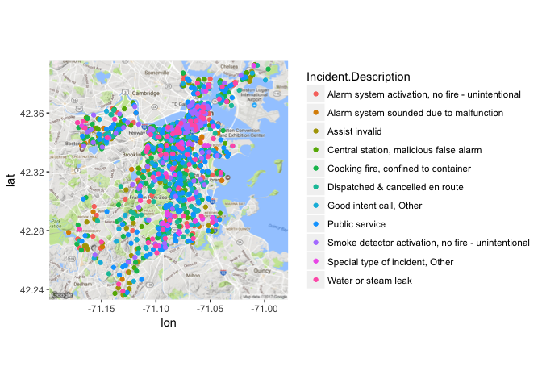

    ## [1] 1091

    ##  [1] FALSE  TRUE  TRUE  TRUE  TRUE FALSE  TRUE  TRUE  TRUE FALSE FALSE
    ## [12] FALSE  TRUE FALSE FALSE  TRUE  TRUE  TRUE FALSE FALSE

    ## 
    ## 17-0006579 17-0006580 17-0006582 17-0006584 17-0006586 17-0006587 
    ##          1          5          1          1          4          1 
    ## 17-0006590 17-0006594 17-0006598 17-0006599 17-0006601 17-0006607 
    ##          1          1          1          5          1          1 
    ## 17-0006622 17-0006624 17-0006633 17-0006645 17-0006648 17-0006653 
    ##          1        228          1          1          1          5 
    ## 17-0006659 17-0006669 17-0006674 17-0006677 17-0006681 17-0006686 
    ##          1          6          1          1          1          1 
    ## 17-0006688 17-0006689 17-0006693 17-0006712 17-0006721 17-0006727 
    ##          1          1          1          1          1          1 
    ## 17-0006741 17-0006744 17-0006745 17-0006748 17-0006750 17-0006751 
    ##          1          3          1          1          1          1 
    ## 17-0006762 17-0006764 17-0006767 17-0006768 17-0006777 17-0006781 
    ##        280          1          1          4          1          1 
    ## 17-0006787 17-0006789 17-0006795 17-0006796 17-0006803 17-0006811 
    ##          1          1          1          1          1          1 
    ## 17-0006813 17-0006815 17-0006819 17-0006841 17-0006865 17-0006867 
    ##          1          1          1          1          2          1 
    ## 17-0006872 17-0006874 17-0006875 17-0006879 17-0006889 17-0006895 
    ##          1          1          8          2          2          1 
    ## 17-0006900 17-0006902 17-0006909 17-0006910 17-0006935 17-0006936 
    ##          2          1          1          2          1          1 
    ## 17-0006964 17-0006972 17-0006974 17-0006993 17-0007000 17-0007015 
    ##          2          2          1          1          1         33 
    ## 17-0007019 17-0007025 17-0007028 17-0007030 17-0007031 17-0007034 
    ##          1          1          1          1          1          1 
    ## 17-0007035 17-0007043 17-0007044 17-0007048 17-0007058 17-0007076 
    ##          1          1          1          1          1          1 
    ## 17-0007081 17-0007084 17-0007090 17-0007091 17-0007105 17-0007107 
    ##          4          1          1          1          1          1 
    ## 17-0007117 17-0007120 17-0007124 17-0007126 17-0007129 17-0007131 
    ##          2          1          1          1          1          1 
    ## 17-0007134 17-0007135 17-0007144 17-0007147 17-0007160 17-0007176 
    ##          2          1          1          1          1          1 
    ## 17-0007178 17-0007180 17-0007193 17-0007197 17-0007215 17-0007219 
    ##          1          1          1          1          1          1 
    ## 17-0007222 17-0007232 17-0007238 17-0007243 17-0007244 17-0007248 
    ##         11          1         10          1          1          1 
    ## 17-0007249 17-0007269 17-0007270 17-0007277 17-0007278 17-0007281 
    ##          1          6          1          1         79          6 
    ## 17-0007282 17-0007284 17-0007299 17-0007306 17-0007310 17-0007317 
    ##          1          3          1          1         24          9 
    ## 17-0007325 17-0007328 17-0007329 17-0007333 17-0007334 17-0007339 
    ##          1          1          4         92          1          1 
    ## 17-0007344 17-0007355 17-0007364 17-0007367 17-0007368 17-0007370 
    ##          1          3          1          1         19          1 
    ## 17-0007379 17-0007382 17-0007385 17-0007392 17-0007393 17-0007394 
    ##          1          1          1          1          1          1 
    ## 17-0007408 17-0007412 17-0007413 17-0007414 17-0007420 17-0007429 
    ##          3          2          1          1         16          1 
    ## 17-0007455 17-0007462 17-0007471 17-0007474 17-0007475 17-0007488 
    ##          1          1          1          2          1          1 
    ## 17-0007489 17-0007495 17-0007499 17-0007500 17-0007506 17-0007509 
    ##          1          1          1          1          1          2 
    ## 17-0007524 17-0007540 17-0007547 17-0007552 17-0007558 17-0007562 
    ##          1          1          4          1          1          1 
    ## 17-0007564 17-0007569 17-0007571 17-0007576 17-0007581 17-0007585 
    ##          3          1          7          1        108          1 
    ## 17-0007590 17-0007605 17-0007607 17-0007611 17-0007628 17-0007629 
    ##          1          4          4          1          2        132 
    ## 17-0007631 17-0007637 17-0007639 17-0007641 17-0007645 17-0007647 
    ##          1          4          1          2          1          1 
    ## 17-0007648 17-0007652 17-0007659 17-0007663 17-0007664 17-0007676 
    ##         22          1          1          1         18          1 
    ## 17-0007692 17-0007693 17-0007698 17-0007707 17-0007720 17-0007727 
    ##          2          2          5         26          1          1 
    ## 17-0007735 17-0007737 17-0007741 17-0007747 17-0007749 17-0007755 
    ##          1          1          1          5         14          2 
    ## 17-0007764 17-0007773 17-0007777 17-0007794 17-0007798 17-0007800 
    ##          1          1          1          1          1          1 
    ## 17-0007803 17-0007804 17-0007806 17-0007815 17-0007827 17-0007833 
    ##          1          1          1          1          1          1 
    ## 17-0007843 17-0007849 17-0007857 17-0007863 17-0007870 17-0007871 
    ##          1          1          1          2          1          6 
    ## 17-0007872 17-0007875 17-0007877 17-0007889 17-0007891 17-0007897 
    ##          1          1          1          4          1          1 
    ## 17-0007902 17-0007903 17-0007916 17-0007917 17-0007922 17-0007927 
    ##          3          1          3          1          1          1 
    ## 17-0007928 17-0007961 17-0007965 17-0007977 17-0007979 17-0007982 
    ##          1          1          3          1          1          1 
    ## 17-0007993 17-0007998 17-0008001 17-0008005 17-0008020 17-0008021 
    ##          1          4          1          8          1          1 
    ## 17-0008029 17-0008031 17-0008037 17-0008039 17-0008041 17-0008042 
    ##          1          1          1          1        284         26 
    ## 17-0008045 17-0008052 17-0008054 17-0008055 17-0008058 17-0008060 
    ##          1          2          8          4          4          1 
    ## 17-0008078 17-0008095 17-0008099 17-0008103 17-0008105 17-0008107 
    ##          1          1          1          2          1          1 
    ## 17-0008117 17-0008118 17-0008121 17-0008129 17-0008142 17-0008149 
    ##          1         24          1          1          6          1 
    ## 17-0008153 17-0008154 17-0008158 17-0008159 17-0008205 17-0008223 
    ##          1         47         35          1         17          1 
    ## 17-0008239 17-0008257 17-0008267 17-0008269 17-0008276 17-0008277 
    ##          1          1          1          1          1          9 
    ## 17-0008289 17-0008291 17-0008293 17-0008299 17-0008306 17-0008309 
    ##          4          1          1          1          8          1 
    ## 17-0008319 17-0008321 17-0008326 17-0008329 17-0008330 17-0008333 
    ##         17          1          1          1          1          1 
    ## 17-0008353 17-0008354 17-0008358 17-0008364 17-0008379 17-0008380 
    ##          7          7        228          3          1          1 
    ## 17-0008386 17-0008392 17-0008412 17-0008429 17-0008434 17-0008447 
    ##          1          2          6          4          1         13 
    ## 17-0008449 17-0008451 17-0008458 17-0008467 17-0008471 17-0008492 
    ##          1          1          1          1          1          1 
    ## 17-0008494 17-0008495 17-0008500 17-0008503 17-0008513 17-0008514 
    ##          1          1          3          1          1          1 
    ## 17-0008521 17-0008536 17-0008545 17-0008546 17-0008553 17-0008558 
    ##          1          1          1          1          2          6 
    ## 17-0008561 17-0008562 17-0008566 17-0008571 17-0008572 17-0008574 
    ##          1          2         89          1          1          1 
    ## 17-0008580 17-0008581 17-0008584 17-0008585 17-0008586 17-0008588 
    ##          4          1          4          1          3          1 
    ## 17-0008593 17-0008600 17-0008604 17-0008612 17-0008617 17-0008618 
    ##          2          1          1          1          4          1 
    ## 17-0008619 17-0008621 17-0008623 17-0008626 17-0008629 17-0008632 
    ##          1         16          1          1          1          1 
    ## 17-0008633 17-0008635 17-0008638 17-0008639 17-0008643 17-0008645 
    ##          1          1         18         16          1          1 
    ## 17-0008649 17-0008660 17-0008666 17-0008668 17-0008674 17-0008675 
    ##          5          7          2          1          1          1 
    ## 17-0008677 17-0008681 17-0008684 17-0008686 17-0008692 17-0008697 
    ##          1          1          1          1          1          3 
    ## 17-0008698 17-0008700 17-0008709 17-0008716 17-0008728 17-0008731 
    ##          1          1          1          1          1          1 
    ## 17-0008732 17-0008734 17-0008736 17-0008737 17-0008752 17-0008755 
    ##          1          6          2          1          1          1 
    ## 17-0008757 17-0008761 17-0008763 17-0008764 17-0008765 17-0008766 
    ##          1          1          1          1          1          1 
    ## 17-0008768 17-0008769 17-0008776 17-0008779 17-0008780 17-0008796 
    ##          5          1          1          1          1          1 
    ## 17-0008799 17-0008812 17-0008813 17-0008816 17-0008819 17-0008841 
    ##          1          1          1        228          2          1 
    ## 17-0008844 17-0008845 17-0008869 17-0008872 17-0008881 17-0008882 
    ##          1        102          1         23          1          1 
    ## 17-0008884 17-0008902 17-0008906 17-0008907 17-0008913 17-0008915 
    ##          4          1          1          1          3          1 
    ## 17-0008916 17-0008922 17-0008927 17-0008930 17-0008943 17-0008945 
    ##          3          1         55          1          1          1 
    ## 17-0008947 17-0008950 17-0008961 17-0008962 17-0008966 17-0008968 
    ##          2          1          1          2          4          1 
    ## 17-0008969 17-0008975 17-0008978 17-0008980 17-0008988 17-0008990 
    ##          1          1          2          1          1          1 
    ## 17-0009013 17-0009015 17-0009016 17-0009021 17-0009022 17-0009024 
    ##          9          5          1         62          1          1 
    ## 17-0009029 17-0009034 17-0009045 17-0009046 17-0009047 17-0009054 
    ##          2          1          3          1          1         16 
    ## 17-0009061 17-0009062 17-0009066 17-0009068 17-0009070 17-0009072 
    ##          1          2          1          1          1          1 
    ## 17-0009076 17-0009085 17-0009093 17-0009097 17-0009101 17-0009106 
    ##          1         26          1          1          1          1 
    ## 17-0009107 17-0009108 17-0009111 17-0009118 17-0009119 17-0009121 
    ##          1          1          1          1          1          7 
    ## 17-0009123 17-0009129 17-0009131 17-0009143 17-0009145 17-0009156 
    ##          2          1          1          1          1          3 
    ## 17-0009162 17-0009170 17-0009172 17-0009178 17-0009192 17-0009201 
    ##          1          7          1         10         84          1 
    ## 17-0009202 17-0009214 17-0009223 17-0009230 17-0009237 17-0009241 
    ##          1          1          1          1          1          1 
    ## 17-0009245 17-0009246 17-0009249 17-0009256 17-0009271 17-0009284 
    ##          1          1          4          1          1          1 
    ## 17-0009286 17-0009287 17-0009289 17-0009297 17-0009299 17-0009312 
    ##          1          1          1          1          1          1 
    ## 17-0009319 17-0009325 17-0009328 17-0009336 17-0009345 17-0009353 
    ##          1         89          1          1          1         26 
    ## 17-0009357 17-0009359 17-0009382 17-0009387 17-0009388 17-0009395 
    ##          5          1          1          1          1          1 
    ## 17-0009396 17-0009409 17-0009422 17-0009424 17-0009427 17-0009439 
    ##          1          1          1          1         24          2 
    ## 17-0009440 17-0009450 17-0009452 17-0009455 17-0009460 17-0009474 
    ##          1          1          1          1          1          1 
    ## 17-0009494 17-0009503 17-0009504 17-0009528 17-0009531 17-0009537 
    ##          1          1          1          1         11          1 
    ## 17-0009546 17-0009551 17-0009552 17-0009561 17-0009564 17-0009571 
    ##         55          1          1          1          1          1 
    ## 17-0009591 17-0009595 17-0009604 17-0009605 17-0009608 17-0009618 
    ##          3          1          1          1          1          1 
    ## 17-0009622 17-0009637 17-0009639 17-0009652 17-0009653 17-0009655 
    ##          1          1         15          1          6          1 
    ## 17-0009661 17-0009689 17-0009699 17-0009719 17-0009724 17-0009730 
    ##          1          1          2          1          1          1 
    ## 17-0009733 17-0009744 17-0009752 17-0009757 17-0009760 17-0009763 
    ##          1          6          1         17          1          2 
    ## 17-0009770 17-0009778 17-0009787 17-0009788 17-0009801 17-0009802 
    ##          1          1          1         81          1          2 
    ## 17-0009805 17-0009807 17-0009809 17-0009813 17-0009814 17-0009818 
    ##          2          1          3          1          1          1 
    ## 17-0009819 17-0009833 17-0009858 17-0009873 17-0009889 17-0009890 
    ##          1          1          1          5          1          1 
    ## 17-0009891 17-0009898 17-0009899 17-0009900 17-0009902 17-0009910 
    ##          1          1          5          1          1          1 
    ## 17-0009913 17-0009920 17-0009927 17-0009928 17-0009929 17-0009937 
    ##          1          1          1          1          1          1 
    ## 17-0009944 17-0009945 17-0009954 17-0009955 17-0009974 17-0009975 
    ##          1          1          1          1          1          2 
    ## 17-0009979 17-0009985 17-0009986 17-0009998 17-0010005 17-0010019 
    ##          1          5          4          1          1          1 
    ## 17-0010020 17-0010027 17-0010028 17-0010031 17-0010036 17-0010044 
    ##         20          3          1          1          1          1 
    ## 17-0010046 17-0010049 17-0010051 17-0010053 17-0010067 17-0010092 
    ##          1          1          1          1          1          1 
    ## 17-0010097 17-0010104 17-0010109 17-0010112 17-0010117 17-0010119 
    ##          1          1          1          1          1          3 
    ## 17-0010131 17-0010133 17-0010137 17-0010158 17-0010161 17-0010166 
    ##          1          1          1          1          1         11 
    ## 17-0010190 17-0010192 17-0010195 17-0010196 17-0010200 17-0010204 
    ##          3          1          1          1          1          1 
    ## 17-0010208 17-0010224 17-0010225 17-0010229 17-0010231 17-0010233 
    ##          3          1          1          4          3          2 
    ## 17-0010238 17-0010241 17-0010243 17-0010246 17-0010248 17-0010254 
    ##          1          1          1         11          2          1 
    ## 17-0010257 17-0010266 17-0010267 17-0010272 17-0010276 17-0010278 
    ##          2          1          1          1        171          1 
    ## 17-0010293 17-0010294 17-0010297 17-0010302 17-0010314 17-0010317 
    ##          2          1        280          1          2          2 
    ## 17-0010323 17-0010325 17-0010328 17-0010341 17-0010343 17-0010346 
    ##          2          1         14          2         11          1 
    ## 17-0010356 17-0010357 17-0010361 17-0010369 17-0010371 17-0010405 
    ##          1          1          1          2          2         13 
    ## 17-0010406 17-0010409 17-0010419 17-0010420 17-0010424 17-0010432 
    ##          1          2          1          2          1          1 
    ## 17-0010433 17-0010440 17-0010443 17-0010450 17-0010455 17-0010457 
    ##         13          1          5          1          1          1 
    ## 17-0010464 17-0010465 17-0010469 17-0010474 17-0010478 17-0010483 
    ##          1         24          2          1          1          1 
    ## 17-0010485 17-0010489 17-0010491 17-0010496 17-0010499 17-0010504 
    ##          5          1         40         40          1          1 
    ## 17-0010507 17-0010509 17-0010511 17-0010513 17-0010514 17-0010515 
    ##          1          1          4          1         23          1 
    ## 17-0010520 17-0010530 17-0010546 17-0010547 17-0010555 17-0010560 
    ##          1          1          1         24          1          1 
    ## 17-0010567 17-0010573 17-0010596 17-0010606 17-0010611 17-0010625 
    ##          1         24          1          1          2          1 
    ## 17-0010630 17-0010632 17-0010635 17-0010638 17-0010639 17-0010646 
    ##         92         41         11          1          1          1 
    ## 17-0010664 17-0010667 17-0010669 17-0010671 17-0010676 17-0010690 
    ##          1         29          1          1          1          1 
    ## 17-0010698 17-0010721 17-0010731 17-0010736 17-0010741 17-0010756 
    ##          1          1          1          1          2          2 
    ## 17-0010762 17-0010764 17-0010765 17-0010769 17-0010781 17-0010794 
    ##          1          1          3          1          1          1 
    ## 17-0010798 17-0010803 17-0010805 17-0010812 17-0010814 17-0010826 
    ##          2          1          1          2          2          1 
    ## 17-0010831 17-0010839 17-0010841 17-0010842 17-0010846 17-0010847 
    ##          3          1          1          1          1          1 
    ## 17-0010849 17-0010850 17-0010864 17-0010870 17-0010882 17-0010883 
    ##          1          1          1          4          1          1 
    ## 17-0010888 17-0010892 17-0010893 17-0010896 17-0010902 17-0010917 
    ##          1          1          1          1          1          2 
    ## 17-0010921 17-0010922 17-0010936 17-0010939 17-0010941 17-0010942 
    ##          1          1          2          1          1          1 
    ## 17-0010947 17-0010950 17-0010951 17-0010953 17-0010954 17-0010965 
    ##          1          1          1          1         67          1 
    ## 17-0010967 17-0010968 17-0010971 17-0010974 17-0010977 17-0010982 
    ##         38          1          2        102          1          1 
    ## 17-0010984 17-0010986 17-0010987 17-0010993 17-0010994 17-0011002 
    ##          1          1          1          5          1          1 
    ## 17-0011006 17-0011015 17-0011016 17-0011019 17-0011021 17-0011024 
    ##          1          1          1          1          1          1 
    ## 17-0011028 17-0011030 17-0011031 17-0011033 17-0011034 17-0011042 
    ##          1          1          1          1          1          4 
    ## 17-0011051 17-0011058 17-0011063 17-0011070 17-0011079 17-0011085 
    ##         38          1          5          1          1          1 
    ## 17-0011088 17-0011089 17-0011090 17-0011093 17-0011094 17-0011103 
    ##          1          2          1          3          1          1 
    ## 17-0011106 17-0011111 17-0011112 17-0011114 17-0011115 17-0011120 
    ##          1          1          7          1          1          1 
    ## 17-0011133 17-0011145 17-0011147 17-0011151 17-0011152 17-0011155 
    ##          2         14          2          1          7          2 
    ## 17-0011156 17-0011167 17-0011172 17-0011186 17-0011188 17-0011191 
    ##          1          1          5          1          1          4 
    ## 17-0011196 17-0011201 17-0011202 17-0011204 17-0011210 17-0011213 
    ##          1          1          1          1          1          1 
    ## 17-0011215 17-0011218 17-0011230 17-0011232 17-0011234 17-0011238 
    ##          1          3          1          1          1          3 
    ## 17-0011242 17-0011246 17-0011247 17-0011250 17-0011255 17-0011257 
    ##          1          1          1          2          7          2 
    ## 17-0011258 17-0011261 17-0011293 17-0011294 17-0011295 17-0011298 
    ##          1          1          1          3          1          1 
    ## 17-0011304 17-0011312 17-0011314 17-0011320 17-0011325 17-0011326 
    ##          1          1          1          4          1          2 
    ## 17-0011333 17-0011346 17-0011354 17-0011359 17-0011363 17-0011365 
    ##          1          1          4          1          1          1 
    ## 17-0011368 17-0011378 17-0011388 17-0011399 17-0011405 17-0011407 
    ##          1          4          1         14          1          1 
    ## 17-0011416 17-0011428 17-0011430 17-0011433 17-0011435 17-0011443 
    ##          1          1         14          1          1          1 
    ## 17-0011454 17-0011465 17-0011467 17-0011469 17-0011476 17-0011479 
    ##          1          1          1          2          1          1 
    ## 17-0011486 17-0011487 17-0011491 17-0011497 17-0011499 17-0011502 
    ##          1          1          1          1          2          4 
    ## 17-0011504 17-0011506 17-0011510 17-0011514 17-0011520 17-0011522 
    ##          1          1          3          1          1          1 
    ## 17-0011523 17-0011526 17-0011527 17-0011531 17-0011533 17-0011538 
    ##          1          1          1          1          5          1 
    ## 17-0011541 17-0011554 17-0011555 17-0011556 17-0011572 17-0011573 
    ##          1          1         79          1          1          1 
    ## 17-0011574 17-0011579 17-0011583 17-0011585 17-0011592 17-0011594 
    ##          1          1          2          1          1          1 
    ## 17-0011606 17-0011608 17-0011609 17-0011613 17-0011619 17-0011621 
    ##         31          4          1          7          1          1 
    ## 17-0011624 17-0011647 17-0011652 17-0011658 17-0011670 17-0011675 
    ##          1          1          1          1          1          1 
    ## 17-0011681 17-0011691 17-0011694 17-0011696 17-0011705 17-0011711 
    ##        129          1          4          1          1          1 
    ## 17-0011716 17-0011719 17-0011722 17-0011725 17-0011730 17-0011731 
    ##          3          3          1          1          1          1 
    ## 17-0011736 17-0011737 17-0011740 17-0011744 17-0011754 17-0011755 
    ##          1          2          1         14          4        102 
    ## 17-0011774 17-0011784 17-0011786 17-0011787 17-0011791 17-0011814 
    ##         75          1          1          1          1          2 
    ## 17-0011816 17-0011817 17-0011819 17-0011822 17-0011823 17-0011825 
    ##          4          1          1          1          1          1 
    ## 17-0011829 17-0011835 17-0011839 17-0011846 17-0011855 17-0011858 
    ##          1          1        203          1          3          1 
    ## 17-0011863 17-0011864 17-0011881 17-0011882 17-0011900 17-0011902 
    ##         28          1          1          3          1          2 
    ## 17-0011912 17-0011918 17-0011919 17-0011931 17-0011937 17-0011938 
    ##          1          1          1          1          1          1 
    ## 17-0011940 17-0011962 17-0011970 17-0011971 17-0011972 17-0011981 
    ##          1          1          4          1          1          1 
    ## 17-0011984 17-0011995 17-0012008 17-0012015 17-0012017 17-0012020 
    ##          1          1          1          4          1          1 
    ## 17-0012031 17-0012033 17-0012034 17-0012036 17-0012039 17-0012048 
    ##          1          1          1          1          1          4 
    ## 17-0012051 17-0012060 17-0012064 17-0012071 17-0012078 17-0012083 
    ##          1          1          1          1          1          1 
    ## 17-0012092 17-0012094 17-0012100 17-0012102 17-0012104 17-0012106 
    ##          1          1          1          1         20          5 
    ## 17-0012114 17-0012116 17-0012125 17-0012128 17-0012129 17-0012130 
    ##          1          1          1          1          1          6 
    ## 17-0012131 17-0012134 17-0012137 17-0012138 17-0012143 17-0012146 
    ##          1          3          1          1         17         10 
    ## 17-0012151 17-0012152 17-0012161 17-0012164 17-0012174 17-0012179 
    ##         79          1          1         19          1          1 
    ## 17-0012184 17-0012185 17-0012188 17-0012194 17-0012207 17-0012213 
    ##         14          1          1         14          1          1 
    ## 17-0012217 17-0012220 17-0012229 17-0012240 17-0012249 17-0012267 
    ##          1         25          5          6          1          1 
    ## 17-0012268 17-0012301 17-0012306 17-0012327 17-0012329 17-0012338 
    ##          1          1          1          1          1          1 
    ## 17-0012358 17-0012364 17-0012371 17-0012379 17-0012391 17-0012396 
    ##          1          1          1          1          1          1 
    ## 17-0012408 17-0012416 17-0012417 17-0012423 17-0012429 17-0012430 
    ##         47          6          1          1        129          1 
    ## 17-0012435 17-0012437 17-0012441 17-0012447 17-0012448 17-0012457 
    ##          1          1          1          1          2          1 
    ## 17-0012459 17-0012460 17-0012466 17-0012477 17-0012479 17-0012487 
    ##          5          1          1        132          1          1 
    ## 17-0012492 17-0012494 17-0012506 17-0012514 17-0012517 17-0012540 
    ##          1          2          1          1          1          1 
    ## 17-0012551 17-0012561 17-0012562 17-0012563 17-0012567 17-0012574 
    ##         79          5          3          1          1          1 
    ## 17-0012578 17-0012579 17-0012584 17-0012588 17-0012593 17-0012599 
    ##          1          1          4         13          1          1 
    ## 17-0012600 17-0012601 17-0012617 17-0012622 17-0012627 17-0012632 
    ##          1          1          1          1          6          1 
    ## 17-0012639 17-0012640 17-0012647 17-0012659 17-0012662 17-0012668 
    ##          2          1          2          1          1          1 
    ## 17-0012692 17-0012693 17-0012696 17-0012705 17-0012760 17-0012767 
    ##          1          1          1          1          1          5 
    ## 17-0012773 17-0012780 17-0012781 17-0012787 17-0012788 17-0012797 
    ##          4          1          2          3          1          1 
    ## 17-0012805 17-0012815 17-0012817 17-0012818 
    ##          1          1          1          1

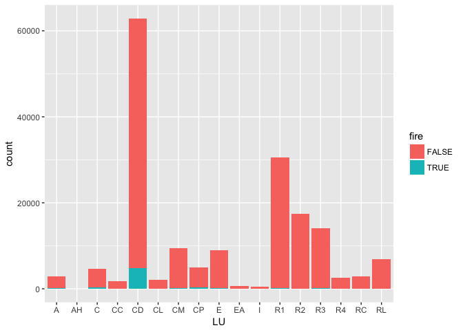

    ## [1] 1091

    ## 
    ## 17-0006579 17-0006580 17-0006582 17-0006584 17-0006586 17-0006587 
    ##          1          1          1          1          3          1 
    ## 17-0006590 17-0006594 17-0006598 17-0006599 17-0006601 17-0006607 
    ##          1          1          1          4          1          1 
    ## 17-0006622 17-0006624 17-0006633 17-0006645 17-0006648 17-0006653 
    ##          1         12          1          1          1          2 
    ## 17-0006659 17-0006669 17-0006674 17-0006677 17-0006681 17-0006686 
    ##          1          6          1          1          1          1 
    ## 17-0006688 17-0006689 17-0006693 17-0006712 17-0006721 17-0006727 
    ##          1          1          1          1          1          1 
    ## 17-0006741 17-0006744 17-0006745 17-0006748 17-0006750 17-0006751 
    ##          1          2          1          1          1          1 
    ## 17-0006762 17-0006764 17-0006767 17-0006768 17-0006777 17-0006781 
    ##          4          1          1          1          1          1 
    ## 17-0006787 17-0006789 17-0006795 17-0006796 17-0006803 17-0006811 
    ##          1          1          1          1          1          1 
    ## 17-0006813 17-0006815 17-0006819 17-0006841 17-0006865 17-0006867 
    ##          1          1          1          1          1          1 
    ## 17-0006872 17-0006874 17-0006875 17-0006879 17-0006889 17-0006895 
    ##          1          1          2          1          2          1 
    ## 17-0006900 17-0006902 17-0006909 17-0006910 17-0006935 17-0006936 
    ##          2          1          1          2          1          1 
    ## 17-0006964 17-0006972 17-0006974 17-0006993 17-0007000 17-0007015 
    ##          2          2          1          1          1          2 
    ## 17-0007019 17-0007025 17-0007028 17-0007030 17-0007031 17-0007034 
    ##          1          1          1          1          1          1 
    ## 17-0007035 17-0007043 17-0007044 17-0007048 17-0007058 17-0007076 
    ##          1          1          1          1          1          1 
    ## 17-0007081 17-0007084 17-0007090 17-0007091 17-0007105 17-0007107 
    ##          2          1          1          1          1          1 
    ## 17-0007117 17-0007120 17-0007124 17-0007126 17-0007129 17-0007131 
    ##          2          1          1          1          1          1 
    ## 17-0007134 17-0007135 17-0007144 17-0007147 17-0007160 17-0007176 
    ##          2          1          1          1          1          1 
    ## 17-0007178 17-0007180 17-0007193 17-0007197 17-0007215 17-0007219 
    ##          1          1          1          1          1          1 
    ## 17-0007222 17-0007232 17-0007238 17-0007243 17-0007244 17-0007248 
    ##          5          1          3          1          1          1 
    ## 17-0007249 17-0007269 17-0007270 17-0007277 17-0007278 17-0007281 
    ##          1          6          1          1         10          3 
    ## 17-0007282 17-0007284 17-0007299 17-0007306 17-0007310 17-0007317 
    ##          1          3          1          1          3          1 
    ## 17-0007325 17-0007328 17-0007329 17-0007333 17-0007334 17-0007339 
    ##          1          1          2          5          1          1 
    ## 17-0007344 17-0007355 17-0007364 17-0007367 17-0007368 17-0007370 
    ##          1          3          1          1          3          1 
    ## 17-0007379 17-0007382 17-0007385 17-0007392 17-0007393 17-0007394 
    ##          1          1          1          1          1          1 
    ## 17-0007408 17-0007412 17-0007413 17-0007414 17-0007420 17-0007429 
    ##          3          2          1          1          1          1 
    ## 17-0007455 17-0007462 17-0007471 17-0007474 17-0007475 17-0007488 
    ##          1          1          1          2          1          1 
    ## 17-0007489 17-0007495 17-0007499 17-0007500 17-0007506 17-0007509 
    ##          1          1          1          1          1          2 
    ## 17-0007524 17-0007540 17-0007547 17-0007552 17-0007558 17-0007562 
    ##          1          1          3          1          1          1 
    ## 17-0007564 17-0007569 17-0007571 17-0007576 17-0007581 17-0007585 
    ##          1          1          3          1         11          1 
    ## 17-0007590 17-0007605 17-0007607 17-0007611 17-0007628 17-0007629 
    ##          1          4          4          1          1          2 
    ## 17-0007631 17-0007637 17-0007639 17-0007641 17-0007645 17-0007647 
    ##          1          2          1          2          1          1 
    ## 17-0007648 17-0007652 17-0007659 17-0007663 17-0007664 17-0007676 
    ##          3          1          1          1          4          1 
    ## 17-0007692 17-0007693 17-0007698 17-0007707 17-0007720 17-0007727 
    ##          1          1          3          3          1          1 
    ## 17-0007735 17-0007737 17-0007741 17-0007747 17-0007749 17-0007755 
    ##          1          1          1          2          3          2 
    ## 17-0007764 17-0007773 17-0007777 17-0007794 17-0007798 17-0007800 
    ##          1          1          1          1          1          1 
    ## 17-0007803 17-0007804 17-0007806 17-0007815 17-0007827 17-0007833 
    ##          1          1          1          1          1          1 
    ## 17-0007843 17-0007849 17-0007857 17-0007863 17-0007870 17-0007871 
    ##          1          1          1          2          1          2 
    ## 17-0007872 17-0007875 17-0007877 17-0007889 17-0007891 17-0007897 
    ##          1          1          1          4          1          1 
    ## 17-0007902 17-0007903 17-0007916 17-0007917 17-0007922 17-0007927 
    ##          3          1          1          1          1          1 
    ## 17-0007928 17-0007961 17-0007965 17-0007977 17-0007979 17-0007982 
    ##          1          1          3          1          1          1 
    ## 17-0007993 17-0007998 17-0008001 17-0008005 17-0008020 17-0008021 
    ##          1          2          1          1          1          1 
    ## 17-0008029 17-0008031 17-0008037 17-0008039 17-0008041 17-0008042 
    ##          1          1          1          1         14          3 
    ## 17-0008045 17-0008052 17-0008054 17-0008055 17-0008058 17-0008060 
    ##          1          2          4          2          3          1 
    ## 17-0008078 17-0008095 17-0008099 17-0008103 17-0008105 17-0008107 
    ##          1          1          1          2          1          1 
    ## 17-0008117 17-0008118 17-0008121 17-0008129 17-0008142 17-0008149 
    ##          1          1          1          1          4          1 
    ## 17-0008153 17-0008154 17-0008158 17-0008159 17-0008205 17-0008223 
    ##          1          2          4          1          3          1 
    ## 17-0008239 17-0008257 17-0008267 17-0008269 17-0008276 17-0008277 
    ##          1          1          1          1          1          4 
    ## 17-0008289 17-0008291 17-0008293 17-0008299 17-0008306 17-0008309 
    ##          3          1          1          1          4          1 
    ## 17-0008319 17-0008321 17-0008326 17-0008329 17-0008330 17-0008333 
    ##          4          1          1          1          1          1 
    ## 17-0008353 17-0008354 17-0008358 17-0008364 17-0008379 17-0008380 
    ##          4          4         12          3          1          1 
    ## 17-0008386 17-0008392 17-0008412 17-0008429 17-0008434 17-0008447 
    ##          1          2          5          1          1         10 
    ## 17-0008449 17-0008451 17-0008458 17-0008467 17-0008471 17-0008492 
    ##          1          1          1          1          1          1 
    ## 17-0008494 17-0008495 17-0008500 17-0008503 17-0008513 17-0008514 
    ##          1          1          1          1          1          1 
    ## 17-0008521 17-0008536 17-0008545 17-0008546 17-0008553 17-0008558 
    ##          1          1          1          1          2          2 
    ## 17-0008561 17-0008562 17-0008566 17-0008571 17-0008572 17-0008574 
    ##          1          2         14          1          1          1 
    ## 17-0008580 17-0008581 17-0008584 17-0008585 17-0008586 17-0008588 
    ##          2          1          2          1          3          1 
    ## 17-0008593 17-0008600 17-0008604 17-0008612 17-0008617 17-0008618 
    ##          2          1          1          1          2          1 
    ## 17-0008619 17-0008621 17-0008623 17-0008626 17-0008629 17-0008632 
    ##          1          1          1          1          1          1 
    ## 17-0008633 17-0008635 17-0008638 17-0008639 17-0008643 17-0008645 
    ##          1          1         10          1          1          1 
    ## 17-0008649 17-0008660 17-0008666 17-0008668 17-0008674 17-0008675 
    ##          4          3          2          1          1          1 
    ## 17-0008677 17-0008681 17-0008684 17-0008686 17-0008692 17-0008697 
    ##          1          1          1          1          1          2 
    ## 17-0008698 17-0008700 17-0008709 17-0008716 17-0008728 17-0008731 
    ##          1          1          1          1          1          1 
    ## 17-0008732 17-0008734 17-0008736 17-0008737 17-0008752 17-0008755 
    ##          1          2          2          1          1          1 
    ## 17-0008757 17-0008761 17-0008763 17-0008764 17-0008765 17-0008766 
    ##          1          1          1          1          1          1 
    ## 17-0008768 17-0008769 17-0008776 17-0008779 17-0008780 17-0008796 
    ##          3          1          1          1          1          1 
    ## 17-0008799 17-0008812 17-0008813 17-0008816 17-0008819 17-0008841 
    ##          1          1          1         12          2          1 
    ## 17-0008844 17-0008845 17-0008869 17-0008872 17-0008881 17-0008882 
    ##          1          9          1          3          1          1 
    ## 17-0008884 17-0008902 17-0008906 17-0008907 17-0008913 17-0008915 
    ##          2          1          1          1          1          1 
    ## 17-0008916 17-0008922 17-0008927 17-0008930 17-0008943 17-0008945 
    ##          2          1          3          1          1          1 
    ## 17-0008947 17-0008950 17-0008961 17-0008962 17-0008966 17-0008968 
    ##          2          1          1          2          2          1 
    ## 17-0008969 17-0008975 17-0008978 17-0008980 17-0008988 17-0008990 
    ##          1          1          1          1          1          1 
    ## 17-0009013 17-0009015 17-0009016 17-0009021 17-0009022 17-0009024 
    ##          4          2          1          5          1          1 
    ## 17-0009029 17-0009034 17-0009045 17-0009046 17-0009047 17-0009054 
    ##          2          1          2          1          1          1 
    ## 17-0009061 17-0009062 17-0009066 17-0009068 17-0009070 17-0009072 
    ##          1          2          1          1          1          1 
    ## 17-0009076 17-0009085 17-0009093 17-0009097 17-0009101 17-0009106 
    ##          1          3          1          1          1          1 
    ## 17-0009107 17-0009108 17-0009111 17-0009118 17-0009119 17-0009121 
    ##          1          1          1          1          1          2 
    ## 17-0009123 17-0009129 17-0009131 17-0009143 17-0009145 17-0009156 
    ##          2          1          1          1          1          3 
    ## 17-0009162 17-0009170 17-0009172 17-0009178 17-0009192 17-0009201 
    ##          1          3          1          5          3          1 
    ## 17-0009202 17-0009214 17-0009223 17-0009230 17-0009237 17-0009241 
    ##          1          1          1          1          1          1 
    ## 17-0009245 17-0009246 17-0009249 17-0009256 17-0009271 17-0009284 
    ##          1          1          2          1          1          1 
    ## 17-0009286 17-0009287 17-0009289 17-0009297 17-0009299 17-0009312 
    ##          1          1          1          1          1          1 
    ## 17-0009319 17-0009325 17-0009328 17-0009336 17-0009345 17-0009353 
    ##          1         14          1          1          1          3 
    ## 17-0009357 17-0009359 17-0009382 17-0009387 17-0009388 17-0009395 
    ##          3          1          1          1          1          1 
    ## 17-0009396 17-0009409 17-0009422 17-0009424 17-0009427 17-0009439 
    ##          1          1          1          1          4          2 
    ## 17-0009440 17-0009450 17-0009452 17-0009455 17-0009460 17-0009474 
    ##          1          1          1          1          1          1 
    ## 17-0009494 17-0009503 17-0009504 17-0009528 17-0009531 17-0009537 
    ##          1          1          1          1          2          1 
    ## 17-0009546 17-0009551 17-0009552 17-0009561 17-0009564 17-0009571 
    ##          3          1          1          1          1          1 
    ## 17-0009591 17-0009595 17-0009604 17-0009605 17-0009608 17-0009618 
    ##          2          1          1          1          1          1 
    ## 17-0009622 17-0009637 17-0009639 17-0009652 17-0009653 17-0009655 
    ##          1          1          2          1          3          1 
    ## 17-0009661 17-0009689 17-0009699 17-0009719 17-0009724 17-0009730 
    ##          1          1          2          1          1          1 
    ## 17-0009733 17-0009744 17-0009752 17-0009757 17-0009760 17-0009763 
    ##          1          1          1          2          1          2 
    ## 17-0009770 17-0009778 17-0009787 17-0009788 17-0009801 17-0009802 
    ##          1          1          1          3          1          1 
    ## 17-0009805 17-0009807 17-0009809 17-0009813 17-0009814 17-0009818 
    ##          2          1          3          1          1          1 
    ## 17-0009819 17-0009833 17-0009858 17-0009873 17-0009889 17-0009890 
    ##          1          1          1          3          1          1 
    ## 17-0009891 17-0009898 17-0009899 17-0009900 17-0009902 17-0009910 
    ##          1          1          2          1          1          1 
    ## 17-0009913 17-0009920 17-0009927 17-0009928 17-0009929 17-0009937 
    ##          1          1          1          1          1          1 
    ## 17-0009944 17-0009945 17-0009954 17-0009955 17-0009974 17-0009975 
    ##          1          1          1          1          1          2 
    ## 17-0009979 17-0009985 17-0009986 17-0009998 17-0010005 17-0010019 
    ##          1          5          2          1          1          1 
    ## 17-0010020 17-0010027 17-0010028 17-0010031 17-0010036 17-0010044 
    ##          1          1          1          1          1          1 
    ## 17-0010046 17-0010049 17-0010051 17-0010053 17-0010067 17-0010092 
    ##          1          1          1          1          1          1 
    ## 17-0010097 17-0010104 17-0010109 17-0010112 17-0010117 17-0010119 
    ##          1          1          1          1          1          2 
    ## 17-0010131 17-0010133 17-0010137 17-0010158 17-0010161 17-0010166 
    ##          1          1          1          1          1          3 
    ## 17-0010190 17-0010192 17-0010195 17-0010196 17-0010200 17-0010204 
    ##          1          1          1          1          1          1 
    ## 17-0010208 17-0010224 17-0010225 17-0010229 17-0010231 17-0010233 
    ##          2          1          1          1          2          2 
    ## 17-0010238 17-0010241 17-0010243 17-0010246 17-0010248 17-0010254 
    ##          1          1          1          3          2          1 
    ## 17-0010257 17-0010266 17-0010267 17-0010272 17-0010276 17-0010278 
    ##          2          1          1          1         12          1 
    ## 17-0010293 17-0010294 17-0010297 17-0010302 17-0010314 17-0010317 
    ##          2          1          4          1          2          2 
    ## 17-0010323 17-0010325 17-0010328 17-0010341 17-0010343 17-0010346 
    ##          2          1          2          2          5          1 
    ## 17-0010356 17-0010357 17-0010361 17-0010369 17-0010371 17-0010405 
    ##          1          1          1          1          1          3 
    ## 17-0010406 17-0010409 17-0010419 17-0010420 17-0010424 17-0010432 
    ##          1          2          1          2          1          1 
    ## 17-0010433 17-0010440 17-0010443 17-0010450 17-0010455 17-0010457 
    ##          3          1          3          1          1          1 
    ## 17-0010464 17-0010465 17-0010469 17-0010474 17-0010478 17-0010483 
    ##          1          3          1          1          1          1 
    ## 17-0010485 17-0010489 17-0010491 17-0010496 17-0010499 17-0010504 
    ##          5          1         11         11          1          1 
    ## 17-0010507 17-0010509 17-0010511 17-0010513 17-0010514 17-0010515 
    ##          1          1          2          1          3          1 
    ## 17-0010520 17-0010530 17-0010546 17-0010547 17-0010555 17-0010560 
    ##          1          1          1          3          1          1 
    ## 17-0010567 17-0010573 17-0010596 17-0010606 17-0010611 17-0010625 
    ##          1          3          1          1          2          1 
    ## 17-0010630 17-0010632 17-0010635 17-0010638 17-0010639 17-0010646 
    ##          5          3          7          1          1          1 
    ## 17-0010664 17-0010667 17-0010669 17-0010671 17-0010676 17-0010690 
    ##          1          2          1          1          1          1 
    ## 17-0010698 17-0010721 17-0010731 17-0010736 17-0010741 17-0010756 
    ##          1          1          1          1          2          1 
    ## 17-0010762 17-0010764 17-0010765 17-0010769 17-0010781 17-0010794 
    ##          1          1          3          1          1          1 
    ## 17-0010798 17-0010803 17-0010805 17-0010812 17-0010814 17-0010826 
    ##          2          1          1          2          2          1 
    ## 17-0010831 17-0010839 17-0010841 17-0010842 17-0010846 17-0010847 
    ##          3          1          1          1          1          1 
    ## 17-0010849 17-0010850 17-0010864 17-0010870 17-0010882 17-0010883 
    ##          1          1          1          4          1          1 
    ## 17-0010888 17-0010892 17-0010893 17-0010896 17-0010902 17-0010917 
    ##          1          1          1          1          1          2 
    ## 17-0010921 17-0010922 17-0010936 17-0010939 17-0010941 17-0010942 
    ##          1          1          2          1          1          1 
    ## 17-0010947 17-0010950 17-0010951 17-0010953 17-0010954 17-0010965 
    ##          1          1          1          1          3          1 
    ## 17-0010967 17-0010968 17-0010971 17-0010974 17-0010977 17-0010982 
    ##          3          1          2          9          1          1 
    ## 17-0010984 17-0010986 17-0010987 17-0010993 17-0010994 17-0011002 
    ##          1          1          1          3          1          1 
    ## 17-0011006 17-0011015 17-0011016 17-0011019 17-0011021 17-0011024 
    ##          1          1          1          1          1          1 
    ## 17-0011028 17-0011030 17-0011031 17-0011033 17-0011034 17-0011042 
    ##          1          1          1          1          1          1 
    ## 17-0011051 17-0011058 17-0011063 17-0011070 17-0011079 17-0011085 
    ##          3          1          3          1          1          1 
    ## 17-0011088 17-0011089 17-0011090 17-0011093 17-0011094 17-0011103 
    ##          1          2          1          1          1          1 
    ## 17-0011106 17-0011111 17-0011112 17-0011114 17-0011115 17-0011120 
    ##          1          1          1          1          1          1 
    ## 17-0011133 17-0011145 17-0011147 17-0011151 17-0011152 17-0011155 
    ##          2          5          2          1          5          2 
    ## 17-0011156 17-0011167 17-0011172 17-0011186 17-0011188 17-0011191 
    ##          1          1          5          1          1          1 
    ## 17-0011196 17-0011201 17-0011202 17-0011204 17-0011210 17-0011213 
    ##          1          1          1          1          1          1 
    ## 17-0011215 17-0011218 17-0011230 17-0011232 17-0011234 17-0011238 
    ##          1          3          1          1          1          3 
    ## 17-0011242 17-0011246 17-0011247 17-0011250 17-0011255 17-0011257 
    ##          1          1          1          2          2          2 
    ## 17-0011258 17-0011261 17-0011293 17-0011294 17-0011295 17-0011298 
    ##          1          1          1          3          1          1 
    ## 17-0011304 17-0011312 17-0011314 17-0011320 17-0011325 17-0011326 
    ##          1          1          1          2          1          2 
    ## 17-0011333 17-0011346 17-0011354 17-0011359 17-0011363 17-0011365 
    ##          1          1          2          1          1          1 
    ## 17-0011368 17-0011378 17-0011388 17-0011399 17-0011405 17-0011407 
    ##          1          2          1          5          1          1 
    ## 17-0011416 17-0011428 17-0011430 17-0011433 17-0011435 17-0011443 
    ##          1          1          5          1          1          1 
    ## 17-0011454 17-0011465 17-0011467 17-0011469 17-0011476 17-0011479 
    ##          1          1          1          2          1          1 
    ## 17-0011486 17-0011487 17-0011491 17-0011497 17-0011499 17-0011502 
    ##          1          1          1          1          2          2 
    ## 17-0011504 17-0011506 17-0011510 17-0011514 17-0011520 17-0011522 
    ##          1          1          1          1          1          1 
    ## 17-0011523 17-0011526 17-0011527 17-0011531 17-0011533 17-0011538 
    ##          1          1          1          1          2          1 
    ## 17-0011541 17-0011554 17-0011555 17-0011556 17-0011572 17-0011573 
    ##          1          1         10          1          1          1 
    ## 17-0011574 17-0011579 17-0011583 17-0011585 17-0011592 17-0011594 
    ##          1          1          1          1          1          1 
    ## 17-0011606 17-0011608 17-0011609 17-0011613 17-0011619 17-0011621 
    ##          1          3          1          3          1          1 
    ## 17-0011624 17-0011647 17-0011652 17-0011658 17-0011670 17-0011675 
    ##          1          1          1          1          1          1 
    ## 17-0011681 17-0011691 17-0011694 17-0011696 17-0011705 17-0011711 
    ##         10          1          2          1          1          1 
    ## 17-0011716 17-0011719 17-0011722 17-0011725 17-0011730 17-0011731 
    ##          2          3          1          1          1          1 
    ## 17-0011736 17-0011737 17-0011740 17-0011744 17-0011754 17-0011755 
    ##          1          1          1          6          3          9 
    ## 17-0011774 17-0011784 17-0011786 17-0011787 17-0011791 17-0011814 
    ##          5          1          1          1          1          1 
    ## 17-0011816 17-0011817 17-0011819 17-0011822 17-0011823 17-0011825 
    ##          3          1          1          1          1          1 
    ## 17-0011829 17-0011835 17-0011839 17-0011846 17-0011855 17-0011858 
    ##          1          1         13          1          3          1 
    ## 17-0011863 17-0011864 17-0011881 17-0011882 17-0011900 17-0011902 
    ##          4          1          1          3          1          2 
    ## 17-0011912 17-0011918 17-0011919 17-0011931 17-0011937 17-0011938 
    ##          1          1          1          1          1          1 
    ## 17-0011940 17-0011962 17-0011970 17-0011971 17-0011972 17-0011981 
    ##          1          1          4          1          1          1 
    ## 17-0011984 17-0011995 17-0012008 17-0012015 17-0012017 17-0012020 
    ##          1          1          1          3          1          1 
    ## 17-0012031 17-0012033 17-0012034 17-0012036 17-0012039 17-0012048 
    ##          1          1          1          1          1          2 
    ## 17-0012051 17-0012060 17-0012064 17-0012071 17-0012078 17-0012083 
    ##          1          1          1          1          1          1 
    ## 17-0012092 17-0012094 17-0012100 17-0012102 17-0012104 17-0012106 
    ##          1          1          1          1          3          2 
    ## 17-0012114 17-0012116 17-0012125 17-0012128 17-0012129 17-0012130 
    ##          1          1          1          1          1          6 
    ## 17-0012131 17-0012134 17-0012137 17-0012138 17-0012143 17-0012146 
    ##          1          2          1          1          1          2 
    ## 17-0012151 17-0012152 17-0012161 17-0012164 17-0012174 17-0012179 
    ##         10          1          1          3          1          1 
    ## 17-0012184 17-0012185 17-0012188 17-0012194 17-0012207 17-0012213 
    ##          5          1          1          5          1          1 
    ## 17-0012217 17-0012220 17-0012229 17-0012240 17-0012249 17-0012267 
    ##          1          2          2          1          1          1 
    ## 17-0012268 17-0012301 17-0012306 17-0012327 17-0012329 17-0012338 
    ##          1          1          1          1          1          1 
    ## 17-0012358 17-0012364 17-0012371 17-0012379 17-0012391 17-0012396 
    ##          1          1          1          1          1          1 
    ## 17-0012408 17-0012416 17-0012417 17-0012423 17-0012429 17-0012430 
    ##          2          3          1          1         10          1 
    ## 17-0012435 17-0012437 17-0012441 17-0012447 17-0012448 17-0012457 
    ##          1          1          1          1          2          1 
    ## 17-0012459 17-0012460 17-0012466 17-0012477 17-0012479 17-0012487 
    ##          2          1          1          2          1          1 
    ## 17-0012492 17-0012494 17-0012506 17-0012514 17-0012517 17-0012540 
    ##          1          2          1          1          1          1 
    ## 17-0012551 17-0012561 17-0012562 17-0012563 17-0012567 17-0012574 
    ##         10          3          3          1          1          1 
    ## 17-0012578 17-0012579 17-0012584 17-0012588 17-0012593 17-0012599 
    ##          1          1          2          2          1          1 
    ## 17-0012600 17-0012601 17-0012617 17-0012622 17-0012627 17-0012632 
    ##          1          1          1          1          3          1 
    ## 17-0012639 17-0012640 17-0012647 17-0012659 17-0012662 17-0012668 
    ##          1          1          1          1          1          1 
    ## 17-0012692 17-0012693 17-0012696 17-0012705 17-0012760 17-0012767 
    ##          1          1          1          1          1          3 
    ## 17-0012773 17-0012780 17-0012781 17-0012787 17-0012788 17-0012797 
    ##          2          1          2          2          1          1 
    ## 17-0012805 17-0012815 17-0012817 17-0012818 
    ##          1          1          1          1

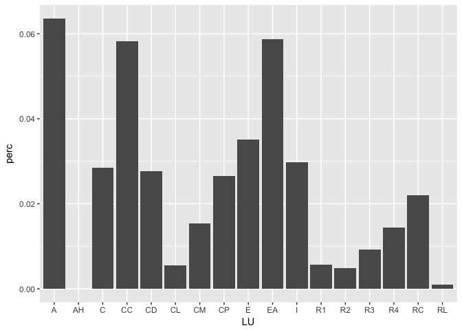

    ## Warning: Removed 1 rows containing missing values (position_stack).

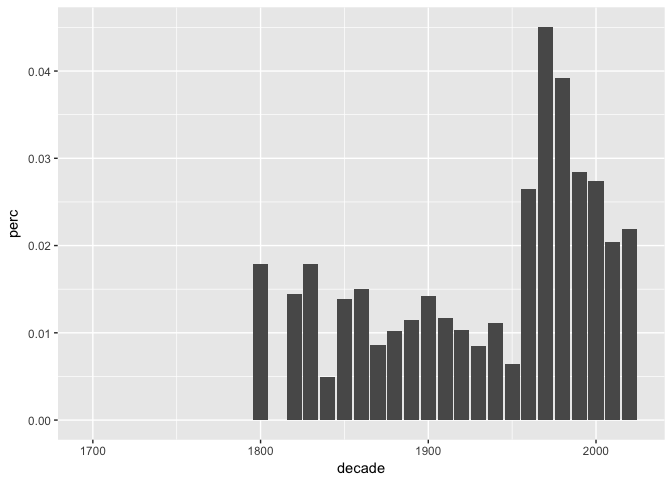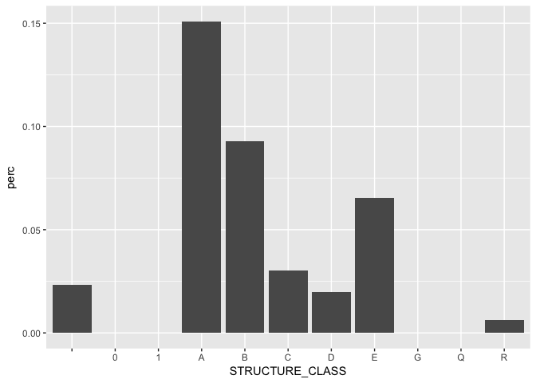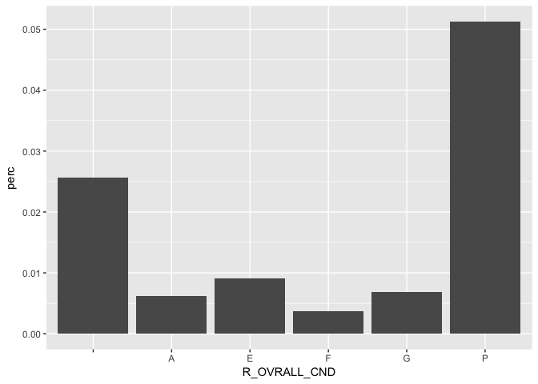

    ## 
    ##                                                                                                                                                                                                                                Accessible Means of Egress 
    ##                                                                                                                                                                                                                                                         1 
    ##                                                                                                                                                                                                                                      Acts 1956 as Amended 
    ##                                                                                                                                                                                                                                                         2 
    ##                                                                                                                                                                                                                                     Approval of Documents 
    ##                                                                                                                                                                                                                                                         1 
    ##                                                                                                                                                                                                                                Approved Construction Doc. 
    ##                                                                                                                                                                                                                                                         1 
    ##                                                                                                                                                                                                                                 Automatic Smoke Detection 
    ##                                                                                                                                                                                                                                                         1 
    ##                                                                                                                                                                                                                                          Basic Principles 
    ##                                                                                                                                                                                                                                                         1 
    ##                                                                                                                                                                     Building Identification - Owner shall to every building a # representing the address. 
    ##                                                                                                                                                                                                                                                         1 
    ##                                                                                                                                                                                                                            Building or Use of Premise req 
    ##                                                                                                                                                                                                                                                         5 
    ##                                                                                                                                                                                                                                  Certificate of Occupancy 
    ##                                                                                                                                                                                                                                                         4 
    ##                                                                                                                                                                                                                                         Covers & Canopies 
    ##                                                                                                                                                                                                                                                         1 
    ##                                                                                                                                                                                                                                             Door Hardware 
    ##                                                                                                                                                                                                                                                         1 
    ##                                                                                                                                                                                                                                           Door Operations 
    ##                                                                                                                                                                                                                                                         2 
    ##                                                                                                                                                                                                                              Door operations-Egress doors 
    ##                                                                                                                                                                                                                                                         1 
    ##                                                                                                                                                                                                                                         Elec work w/o per 
    ##                                                                                                                                                                                                                                                         1 
    ##                                                                                                                                                                                                                                          Emergency Escape 
    ##                                                                                                                                                                                                                                                         1 
    ##                                                                                                                                                                                                                                 Emergency Escape & Rescue 
    ##                                                                                                                                                                                                                                                         1 
    ##                                                                                                                                                                                                                               Emergency escape and rescue 
    ##                                                                                                                                                                                                                                                         1 
    ##                                                                                                                                                                                                                                            Emergency Exit 
    ##                                                                                                                                                                                                                                                         1 
    ##                                                                                                                                                                                                                                          Exit Passageways 
    ##                                                                                                                                                                                                                                                         2 
    ##                                                                                                                                                                                                                                                Exit Signs 
    ##                                                                                                                                                                                                                                                         1 
    ##                                                                                                                                                                                                                                                     Exits 
    ##                                                                                                                                                                                                                                                         1 
    ##                                                                                                                                                                                                                                          Exits Maintained 
    ##                                                                                                                                                                                                                                                         1 
    ## Extermination of Insects, Rodents and Skunks - The owner of a dwelling containing two or more dwelling units shall maintain it and its premises free from all rodents, cockroaches and insect infestation and shall be responsible for exterminating them 
    ##                                                                                                                                                                                                                                                         1 
    ##                                                                                                                                                                                                                             Failed to comply w PRMT Terms 
    ##                                                                                                                                                                                                                                                        11 
    ##                                                                                                                                                                                                                                Failure clean sidewalk com 
    ##                                                                                                                                                                                                                                                        14 
    ##                                                                                                                                                                                                                             Failure clear sidewalk - snow 
    ##                                                                                                                                                                                                                                                      1991 
    ##                                                                                                                                                                                                                            Failure clear sidewalk - snow: 
    ##                                                                                                                                                                                                                                                       136 
    ##                                                                                                                                                                                                                                  Failure to Obtain Permit 
    ##                                                                                                                                                                                                                                                       106 
    ##                                                                                                                                                                                                                                       Failure To Register 
    ##                                                                                                                                                                                                                                                        19 
    ##                                                                                                                                                                                                                            Failure to secure a Re-Inspect 
    ##                                                                                                                                                                                                                                                         5 
    ##                                                                                                                                                                                                                                  Failure to secure permit 
    ##                                                                                                                                                                                                                                                         6 
    ##                                                                                                                                                                                                                             Fire Protection & Life Safety 
    ##                                                                                                                                                                                                                                                         1 
    ##                                                                                                                                                                                                                                   Fire Protection Systems 
    ##                                                                                                                                                                                                                                                         2 
    ##                                                                                                                                                                                                                                   Graffiti on building- 1 
    ##                                                                                                                                                                                                                                                        38 
    ##                                                                                                                                                                                                                                   Graffiti on building- 2 
    ##                                                                                                                                                                                                                                                        11 
    ##                                                                                                                                                                                                                                    Guarding of Live parts 
    ##                                                                                                                                                                                                                                                         1 
    ##                                                                                                                                                                                                                                                    Guards 
    ##                                                                                                                                                                                                                                                         2 
    ##                                                                                                                                                                                                                                                      IEBC 
    ##                                                                                                                                                                                                                                                         1 
    ##                                                                                                                                                                                                                              Illegal dumping < 1 cubic yd 
    ##                                                                                                                                                                                                                                                       141 
    ##                                                                                                                                                                                                                            Illegal dumping 1-5 cubic yd.: 
    ##                                                                                                                                                                                                                                                         2 
    ##                                                                                                                                                                                                                              illegal parking prop owner 1 
    ##                                                                                                                                                                                                                                                       156 
    ##                                                                                                                                                                                                                              illegal parking prop owner 2 
    ##                                                                                                                                                                                                                                                        91 
    ##                                                                                                                                                                                                                                           Illegal Vending 
    ##                                                                                                                                                                                                                                                        11 
    ##                                                                                                                                                                                                                                              Illumination 
    ##                                                                                                                                                                                                                                                         2 
    ##                                                                                                                                                                                                                               Improper storage trash: com 
    ##                                                                                                                                                                                                                                                       596 
    ##                                                                                                                                                                                                                               Improper storage trash: res 
    ##                                                                                                                                                                                                                                                      6340 
    ##                                                                                                                                                                                                                                              Installation 
    ##                                                                                                                                                                                                                                                         1 
    ##                                                                                                                                                                                                                               Large building recycling- 1 
    ##                                                                                                                                                                                                                                                         2 
    ##                                                                                                                                                                                                                                         Locks and Latches 
    ##                                                                                                                                                                                                                                                        14 
    ##                                                                                                                                                                                                                                 Maint a dumpster wopermit 
    ##                                                                                                                                                                                                                                                        10 
    ##                                           Maint. of Areas Free from Garbage & Rubbish(Common Areas) - In any dwelling, the owner shall be responsible for maintaining in a clean and sanitary condition free of garbage, rubbish, filth all common areas. 
    ##                                                                                                                                                                                                                                                         1 
    ##                                                                                                                                                                                                                                               Maintenance 
    ##                                                                                                                                                                                                                                                        21 
    ##                                                                                                                                                                                                                              Materials (A) Min. Standards 
    ##                                                                                                                                                                                                                                                         1 
    ##                                                                                                                                                                                                                                 Maximum Height from Floor 
    ##                                                                                                                                                                                                                                                         1 
    ##                                                                                                                                                                                                                                           Means of Egress 
    ##                                                                                                                                                                                                                                                         1 
    ##                                                                                                                                                                                                                                   No Number On A Building 
    ##                                                                                                                                                                                                                                                         9 
    ##                                                                                                                                                                                                                                No use of premises permit: 
    ##                                                                                                                                                                                                                                                         2 
    ##                                                                                                                                                                                                                                 Non-Emergency Auto Repair 
    ##                                                                                                                                                                                                                                                         4 
    ##                                                                                                                                                                                                                             Occupying City prop wo permit 
    ##                                                                                                                                                                                                                                                       111 
    ##                                                                                                                                                                                                                            Overfilling of barrel/dumpster 
    ##                                                                                                                                                                                                                                                       711 
    ##                                                                                                                                                                                                                               Overgrown Weeds On Property 
    ##                                                                                                                                                                                                                                                       655 
    ##                      Owners Installation/Maintenance Responsibility - All facilities and equipment which are required by owner including but not limited to water, gas, electrical and heating, shall be installed in accordance with all accepted codes. 
    ##                                                                                                                                                                                                                                                         2 
    ##                                                                                                Owners Responsibility to Maintain Structural Elements - Structural elements  shall be maintained free from holes, cracks, loose plaster, or other defects. 
    ##                                                                                                                                                                                                                                                         2 
    ##                                                                                                                                                                                                                                      Periodic Inspections 
    ##                                                                                                                                                                                                                                                         4 
    ##                                                                                                                                                                                                                                                   Permits 
    ##                                                                                                                                                                                                                                                         1 
    ##                                                                                                                                                                                                                                Posting signs wo authority 
    ##                                                                                                                                                                                                                                                         7 
    ##                                                                                                                                                                                                                               Protection of Adj. Property 
    ##                                                                                                                                                                                                                                                         7 
    ##                                                                                                                                                                                          Protective Railings and Walls - Safe handrail for every stairway 
    ##                                                                                                                                                                                                                                                         2 
    ##                                                                                                                                                                                                                                          Referenced Codes 
    ##                                                                                                                                                                                                                                                         1 
    ##                                                                                                                                                                                                                                 Reg. Access to Roof Areas 
    ##                                                                                                                                                                                                                                                         1 
    ##                                                                                                                                                                                                                             Removal snow non-res property 
    ##                                                                                                                                                                                                                                                        57 
    ##                                                                                                                                                                                                                                 Removal snow private prop 
    ##                                                                                                                                                                                                                                                        22 
    ##                                                                                                                                                                                                                             Removal snow private property 
    ##                                                                                                                                                                                                                                                        10 
    ##                                                                                                                                                                                                                                      Required Inspections 
    ##                                                                                                                                                                                                                                                         1 
    ##                                                                                                                                                                                                                                            Retaining Wall 
    ##                                                                                                                                                                                                                                                         1 
    ##                                                                                                                                                                                                                                            Right of Entry 
    ##                                                                                                                                                                                                                                                         9 
    ##  Screens for Doors - Owner shall provide screens for all doorways opening directly to the outside from any dwelling unit or rooming unit; shall be tight fitting; equipped with self-closing device except where screen is designed to slide to the side. 
    ##                                                                                                                                                                                                                                                         2 
    ##                                                      Screens for Windows - Owner shall provide screens for all windows on the first 4 floors opening directly to the outside; shall be tight fitting; shall cover opening part of window designed to open 
    ##                                                                                                                                                                                                                                                         1 
    ##                                                                                                                                                                                                                                     Securing & Supporting 
    ##                                                                                                                                                                                                                                                         1 
    ##                                                                                                                                                                                                                                          Security Grilles 
    ##                                                                                                                                                                                                                                                         1 
    ##                                                                                                 Shared Facilities - Sinks, Toilets, Tubs, showers shared by more than 1 unit or 1 rooming unit shall be cleaned and sanitized once every 24 hrs by owner. 
    ##                                                                                                                                                                                                                                                         1 
    ##                                                                                                                                                                                                                                         Shopping Cart - 1 
    ##                                                                                                                                                                                                                                                         1 
    ##                                                                                                                                                                                                                             Sign: COB Zoning Article 11-1 
    ##                                                                                                                                                                                                                                                         2 
    ##                          Sinks, Toilets, Tubs, Showers - Owner shall provide a toilet, a wash basin, bathtub or shower in another room which is not used for living, sleeping, cooking or eating; room must be fitted with a door capable of being closed 
    ##                                                                                                                                                                                                                                                         1 
    ##                                                                                                                                                                                                                            Site Cleanliness license – VIO 
    ##                                                                                                                                                                                                                                                         2 
    ##                                                                                                                                                                                                                            Site Cleanliness license – WAR 
    ##                                                                                                                                                                                                                                                        67 
    ##                                                                                                                                                                                                                                       Submittal Documents 
    ##                                                                                                                                                                                                                                                         1 
    ##                                                                                                                                                                                                                                   Testing & Certification 
    ##                                                                                                                                                                                                                                                        14 
    ##                                                                                                                                                                                                                                   Testing and Maintenance 
    ##                                                                                                                                                                                                                                                         1 
    ##                                                                                                                                                                                                                            Trash illegally dump container 
    ##                                                                                                                                                                                                                                                        13 
    ##                                                                                                                                                                                                                                      Unlawful Continuance 
    ##                                                                                                                                                                                                                                                         1 
    ##                                                                                                                                                                                                                            Unregistered motor vehicles- 2 
    ##                                                                                                                                                                                                                                                       116 
    ##                                                                                                                                                                                                                             Unregistered motor vehicles-1 
    ##                                                                                                                                                                                                                                                        71 
    ##                                                                                                                                                                                                                                      Unsafe and Dangerous 
    ##                                                                                                                                                                                                                                                         2 
    ##                                                                                                                                                                                                                                          Unsafe Structure 
    ##                                                                                                                                                                                                                                                        90 
    ##                                                                                                                                                                                                                                           Use of Premises 
    ##                                                                                                                                                                                                                                                         2 
    ##                                                                                                                                                                                                                                      Weathertight Windows 
    ##                                                                                                                                                                                                                                                         2
