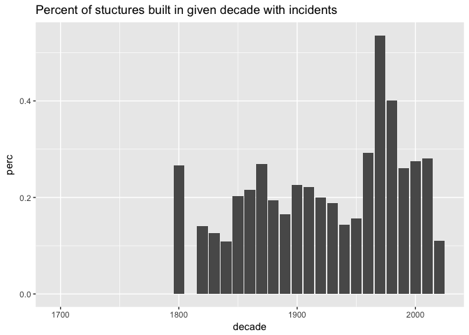
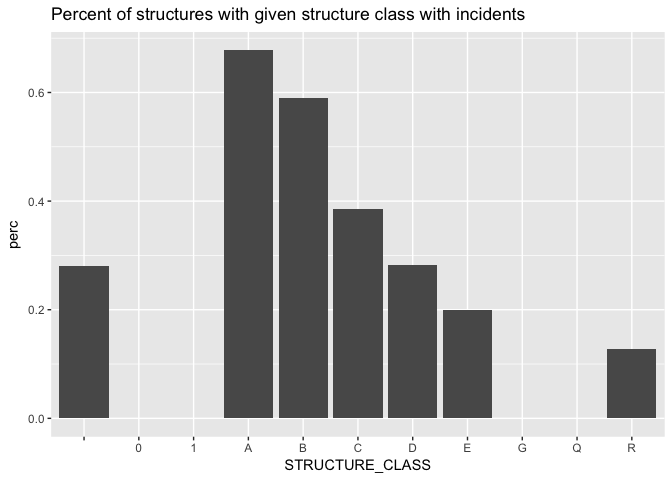

### kinds of incidents

    ## 
    ##                                   Aircraft standby 
    ##                                                  4 
    ##   Alarm system activation, no fire - unintentional 
    ##                                                163 
    ##            Alarm system sounded due to malfunction 
    ##                                                 92 
    ##                                     Animal problem 
    ##                                                  1 
    ##                              Animal problem, Other 
    ##                                                  1 
    ##               Arcing, shorted electrical equipment 
    ##                                                 20 
    ##                                     Assist invalid 
    ##                                                103 
    ##         Assist police or other governmental agency 
    ##                                                 40 
    ##                                    Attempt to burn 
    ##                                                  1 
    ##                                          BFD Drill 
    ##                                                 63 
    ##                    Biological hazard investigation 
    ##                                                  1 
    ##          Biological hazard, confirmed or suspected 
    ##                                                  3 
    ##                               Bomb scare - no bomb 
    ##                                                  2 
    ##                         Breakdown of light ballast 
    ##                                                  1 
    ##              Brush or brush-and-grass mixture fire 
    ##                                                  6 
    ##                                      Building fire 
    ##                                                 28 
    ##         Carbon monoxide detector activation, no CO 
    ##                                                 18 
    ##                           Carbon monoxide incident 
    ##                                                 29 
    ##             Central station, malicious false alarm 
    ##                                                238 
    ##                 Chemical hazard (no spill or leak) 
    ##                                                  4 
    ##                             Chemical spill or leak 
    ##                                                  2 
    ##                                  Citizen complaint 
    ##                                                  2 
    ##          CO detector activation due to malfunction 
    ##                                                 37 
    ##  Combustible/flammable gas/liquid condition, other 
    ##                                                  1 
    ##                Cooking fire, confined to container 
    ##                                                296 
    ##                  Cover assignment, standby, moveup 
    ##                                                  4 
    ##                   Defective elevator, no occupants 
    ##                                                  3 
    ##       Detector activation, no fire - unintentional 
    ##                                                 22 
    ##            Direct tie to FD, malicious false alarm 
    ##                                                 65 
    ##                    Dispatched & cancelled en route 
    ##                                                153 
    ##    Dumpster or other outside trash receptacle fire 
    ##                                                  5 
    ##        Electrical  wiring/equipment problem, Other 
    ##                                                 34 
    ##                    Extinguishing system activation 
    ##                                                  1 
    ##                   False alarm or false call, Other 
    ##                                                 30 
    ##                                        Fire, Other 
    ##                                                  7 
    ##     FIU activity  (not covered by other inc types) 
    ##                                                  4 
    ##      Fuel burner/boiler malfunction, fire confined 
    ##                                                  4 
    ##                      Gas leak (natural gas or LPG) 
    ##                                                 51 
    ##           Gasoline or other flammable liquid spill 
    ##                                                 28 
    ##                            Good intent call, Other 
    ##                                                197 
    ##                         Hazardous condition, Other 
    ##                                                 42 
    ##           HazMat release investigation w/no HazMat 
    ##                                                  5 
    ##        Heat detector activation due to malfunction 
    ##                                                  7 
    ##   Heat from short circuit (wiring), defective/worn 
    ##                                                  5 
    ##          Local alarm system, malicious false alarm 
    ##                                                 69 
    ##                                           Lock-out 
    ##                                                 56 
    ##           Malicious, mischievous false call, Other 
    ##                                                 13 
    ##              Mobile property (vehicle) fire, Other 
    ##                                                  2 
    ##      Municipal alarm system, malicious false alarm 
    ##                                                 40 
    ##                     Natural vegetation fire, Other 
    ##                                                  3 
    ##   No Incident found on arrival at dispatch address 
    ##                                                  6 
    ##              Oil or other combustible liquid spill 
    ##                                                 29 
    ##                             Outside equipment fire 
    ##                                                  5 
    ##                        Outside rubbish fire, Other 
    ##                                                 11 
    ##               Outside rubbish, trash or waste fire 
    ##                                                 16 
    ##  Outside stationary compactor/compacted trash fire 
    ##                                                  2 
    ##                                   Overheated motor 
    ##                                                 12 
    ##               Overpressure rupture of steam boiler 
    ##                                                  2 
    ##                             Passenger vehicle fire 
    ##                                                 17 
    ##                          Person in distress, Other 
    ##                                                  9 
    ##                                      Police matter 
    ##                                                 48 
    ##                                    Power line down 
    ##                                                 15 
    ##                                     Public service 
    ##                                                320 
    ##                   Public service assistance, Other 
    ##                                                 24 
    ##                                  Rail vehicle fire 
    ##                                                  2 
    ##                                 Refrigeration leak 
    ##                                                  2 
    ##             Road freight or transport vehicle fire 
    ##                                                  2 
    ##                                Service Call, other 
    ##                                                 63 
    ##          Severe weather or natural disaster, Other 
    ##                                                  5 
    ##       Smoke detector activation due to malfunction 
    ##                                                 43 
    ## Smoke detector activation, no fire - unintentional 
    ##                                                136 
    ##                    Smoke from barbecue, tar kettle 
    ##                                                  9 
    ##                              Smoke or odor removal 
    ##                                                  9 
    ##                         Smoke scare, odor of smoke 
    ##                                                 57 
    ##                        Special outside fire, Other 
    ##                                                  2 
    ##                    Special type of incident, Other 
    ##                                                149 
    ##            Sprinkler activation due to malfunction 
    ##                                                 18 
    ##      Sprinkler activation, no fire - unintentional 
    ##                                                  5 
    ##         Steam, Other gas mistaken for smoke, Other 
    ##                                                  6 
    ##      Steam, vapor, fog or dust thought to be smoke 
    ##                                                 65 
    ##                          System malfunction, Other 
    ##                                                 21 
    ##                   Telephone, malicious false alarm 
    ##                                                  5 
    ##                   Trash or rubbish fire, contained 
    ##                                                 12 
    ##         Unintentional transmission of alarm, Other 
    ##                                                 30 
    ##        Vicinity alarm (incident in other location) 
    ##                                                 15 
    ##                                   Water evacuation 
    ##                                                  1 
    ##                                Water or steam leak 
    ##                                                 96 
    ##                               Water problem, Other 
    ##                                                  5 
    ##                                     Wrong location 
    ##                                                 22

Only some of these represent real emergencies, so let's drop everything
that isn't.

### Incidents by Time

Let's look at how incidents differ across time of day and day of week
(and month and year, once more data is available).

### Incidents by Location

    ## converting bounding box to center/zoom specification. (experimental)

    ## Source : https://maps.googleapis.com/maps/api/staticmap?center=42.314518,-71.084491&zoom=12&size=640x640&scale=2&maptype=terrain&language=en-EN

### Incidents by Structure Type

For incidents that occor in structures, we can match the incident via
its address to data from the assessor's office to learn details about
the structure. (This is an imperfect matching process currently, but
could be refined to give greater confidence beyond the rough sketch
here.)

### Fires and Code Violations

(Work in Progress)
