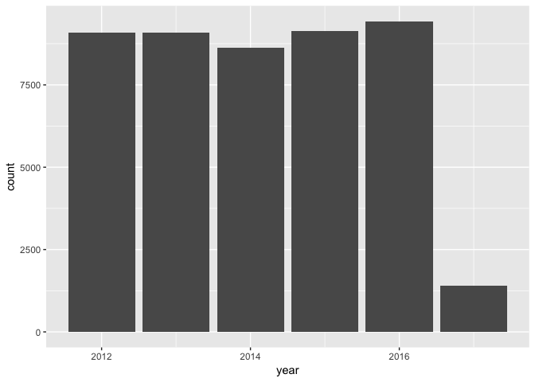
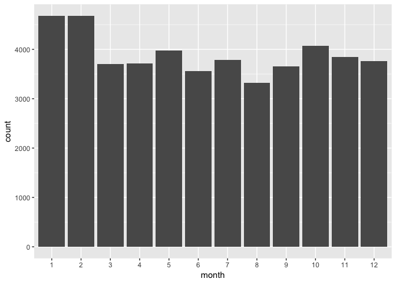
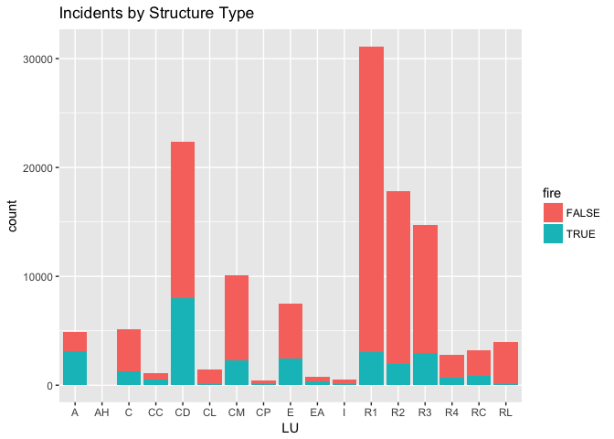
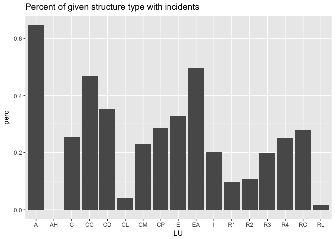

### kinds of incidents

    ##                                   Incident.Description count
    ## 1                  Accident, potential accident, Other    72
    ## 2     Air or gas rupture of pressure or process vessel     6
    ## 3                                        Aircraft fire     3
    ## 4                                     Aircraft standby   255
    ## 5     Alarm system activation, no fire - unintentional 10270
    ## 6              Alarm system sounded due to malfunction  6643
    ## 7                                       Animal problem    62
    ## 8                                Animal problem, Other    30
    ## 9                                        Animal rescue   111
    ## 10                Arcing, shorted electrical equipment  1125
    ## 11                                      Assist invalid  3324
    ## 12          Assist police or other governmental agency  4290
    ## 13                                     Attempt to burn    51
    ## 14            Attempted burning, illegal action, Other    20
    ## 15                       Authorized controlled burning    49
    ## 16                                           BFD Drill  1137
    ## 17                     Biological hazard investigation    20
    ## 18           Biological hazard, confirmed or suspected    96
    ## 19           Biological hazard, malicious false report     3
    ## 20                  Blasting agent explosion (no fire)     3
    ## 21                                Bomb scare - no bomb   636
    ## 22                          Breakdown of light ballast   165
    ## 23               Brush or brush-and-grass mixture fire  1485
    ## 24                                       Building fire  2520
    ## 25         Building or structure weakened or collapsed   131
    ## 26          Carbon monoxide detector activation, no CO  2293
    ## 27                            Carbon monoxide incident  2281
    ## 28              Central station, malicious false alarm 13086
    ## 29                  Chemical hazard (no spill or leak)    55
    ## 30         Chemical reaction rupture of process vessel     2
    ## 31                              Chemical spill or leak   197
    ## 32   Chimney or flue fire, confined to chimney or flue   119
    ## 33                                   Citizen complaint   101
    ## 34           CO detector activation due to malfunction  2681
    ## 35   Combustible/flammable gas/liquid condition, other   325
    ## 36      Commercial Compactor fire, confined to rubbish    16
    ## 37            Construction or demolition landfill fire    19
    ## 38                 Cooking fire, confined to container 17965
    ## 39                   Cover assignment, standby, moveup   250
    ## 40                       Cultivated grain or crop fire     2
    ## 41                 Cultivated orchard or vineyard fire     1
    ## 42              Cultivated trees or nursery stock fire     6
    ## 43             Cultivated vegetation, crop fire, Other    12
    ## 44                    Defective elevator, no occupants   228
    ## 45        Detector activation, no fire - unintentional  1595
    ## 46             Direct tie to FD, malicious false alarm  3987
    ## 47                     Dispatched & cancelled en route 10520
    ## 48     Dumpster or other outside trash receptacle fire   543
    ## 49                               Earthquake assessment     1
    ## 50         Electrical  wiring/equipment problem, Other  2902
    ## 51       Excessive heat, scorch burns with no ignition    71
    ## 52                          Explosion (no fire), Other     8
    ## 53   Explosive, bomb removal (for bomb scare, use 721)    10
    ## 54                     Extinguishing system activation   137
    ## 55  Extinguishing system activation due to malfunction   118
    ## 56                    False alarm or false call, Other  2475
    ## 57         Fire in mobile home used as fixed residence     1
    ## 58    Fire in mobile prop used as a fixed struc, Other     2
    ## 59    Fire in motor home, camper, recreational vehicle     4
    ## 60           Fire in portable building, fixed location     4
    ## 61                                         Fire, Other   588
    ## 62         Fires in structure other than in a building   136
    ## 63                       Fireworks explosion (no fire)    25
    ## 64      FIU activity  (not covered by other inc types)   226
    ## 65                                    Flood assessment     5
    ## 66                      Forest, woods or wildland fire   151
    ## 67       Fuel burner/boiler malfunction, fire confined   416
    ## 68              Garbage dump or sanitary landfill fire    16
    ## 69                       Gas leak (natural gas or LPG)  2754
    ## 70            Gasoline or other flammable liquid spill  1742
    ## 71                             Good intent call, Other 15073
    ## 72                                          Grass fire   460
    ## 73                          Hazardous condition, Other  2322
    ## 74            HazMat release investigation w/no HazMat   119
    ## 75         Heat detector activation due to malfunction   397
    ## 76    Heat from short circuit (wiring), defective/worn   377
    ## 77  Incinerator overload or malfunction, fire confined     6
    ## 78                          Lightning strike (no fire)     7
    ## 79           Local alarm system, malicious false alarm  4372
    ## 80                                            Lock-out  3376
    ## 81            Malicious, mischievous false call, Other   775
    ## 82               Mobile property (vehicle) fire, Other    87
    ## 83       Municipal alarm system, malicious false alarm  3498
    ## 84               Munitions or bomb explosion (no fire)     1
    ## 85                      Natural vegetation fire, Other  1015
    ## 86    No Incident found on arrival at dispatch address   172
    ## 87                                                NULL     1
    ## 88            Off-road vehicle or heavy equipment fire    18
    ## 89               Oil or other combustible liquid spill  1875
    ## 90                              Outside equipment fire   101
    ## 91           Outside gas or vapor combustion explosion     3
    ## 92                                Outside mailbox fire    11
    ## 93                         Outside rubbish fire, Other   605
    ## 94                Outside rubbish, trash or waste fire  1542
    ## 95   Outside stationary compactor/compacted trash fire    13
    ## 96                                Outside storage fire    15
    ## 97                                    Overheated motor   945
    ## 98         Overpressure rupture from air or gas, Other     7
    ## 99              Overpressure rupture from steam, Other    28
    ## 100   Overpressure rupture of air or gas pipe/pipeline     6
    ## 101     Overpressure rupture of boiler from air or gas     1
    ## 102               Overpressure rupture of steam boiler    18
    ## 103     Overpressure rupture of steam pipe or pipeline    57
    ## 104    Overpressure rupture, explosion, overheat other    33
    ## 105                             Passenger vehicle fire  1267
    ## 106                          Person in distress, Other   407
    ## 107                                      Police matter  4037
    ## 108                                    Power line down  1141
    ## 109                                    Prescribed fire    28
    ## 110                                     Public service 27409
    ## 111                   Public service assistance, Other  2457
    ## 112               Radiation leak, radioactive material     3
    ## 113                       Radioactive condition, Other     6
    ## 114                                  Rail vehicle fire    19
    ## 115                                 Refrigeration leak    35
    ## 116                            Ring or jewelry removal    46
    ## 117             Road freight or transport vehicle fire    84
    ## 118                                Service Call, other  4047
    ## 119         Severe weather or natural disaster standby     4
    ## 120          Severe weather or natural disaster, Other    29
    ## 121       Smoke detector activation due to malfunction  3634
    ## 122 Smoke detector activation, no fire - unintentional  9921
    ## 123                    Smoke from barbecue, tar kettle   441
    ## 124                              Smoke or odor removal   209
    ## 125                         Smoke scare, odor of smoke  3639
    ## 126                        Special outside fire, Other   330
    ## 127                    Special type of incident, Other  2452
    ## 128            Sprinkler activation due to malfunction   640
    ## 129      Sprinkler activation, no fire - unintentional   760
    ## 130        Steam rupture of pressure or process vessel     4
    ## 131         Steam, Other gas mistaken for smoke, Other   568
    ## 132      Steam, vapor, fog or dust thought to be smoke  3697
    ## 133                          System malfunction, Other  1433
    ## 134                   Telephone, malicious false alarm   618
    ## 135                                     Threat to burn     6
    ## 136                             Toxic condition, Other    46
    ## 137                   Trash or rubbish fire, contained   610
    ## 138                               Unauthorized burning    64
    ## 139         Unintentional transmission of alarm, Other  3017
    ## 140        Vicinity alarm (incident in other location)   742
    ## 141                                   Water evacuation    22
    ## 142                                Water or steam leak  6563
    ## 143                               Water problem, Other   492
    ## 144                                 Water vehicle fire    17
    ## 145           Wind storm, tornado/hurricane assessment    38
    ## 146                                     Wrong location  2128

Only some of these represent real emergencies, so let's drop everything
that isn't.

### Incidents by Time

Let's look at how incidents differ across year, month, day of week, and
time of day.

### Incidents by Location

    ## converting bounding box to center/zoom specification. (experimental)

    ## Source : https://maps.googleapis.com/maps/api/staticmap?center=42.312814,-71.08832&zoom=12&size=640x640&scale=2&maptype=terrain&language=en-EN

### Incidents by Structure Type

For incidents that occor in structures, we can match the incident via
its address to data from the assessor's office to learn details about
the structure. (This is an imperfect matching process currently, but
could be refined to give greater confidence beyond the rough sketch
here.)

### Fires and Code Violations

(Work in Progress)
